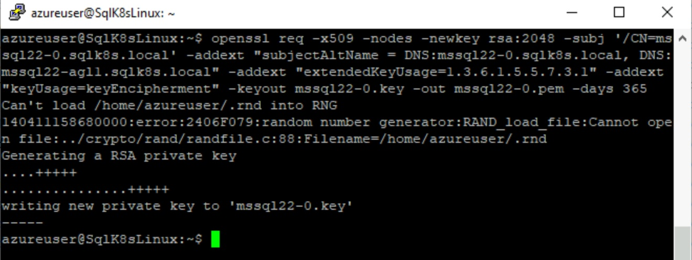
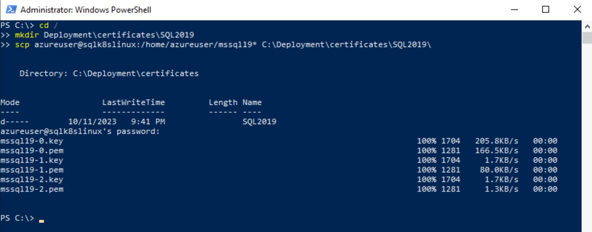
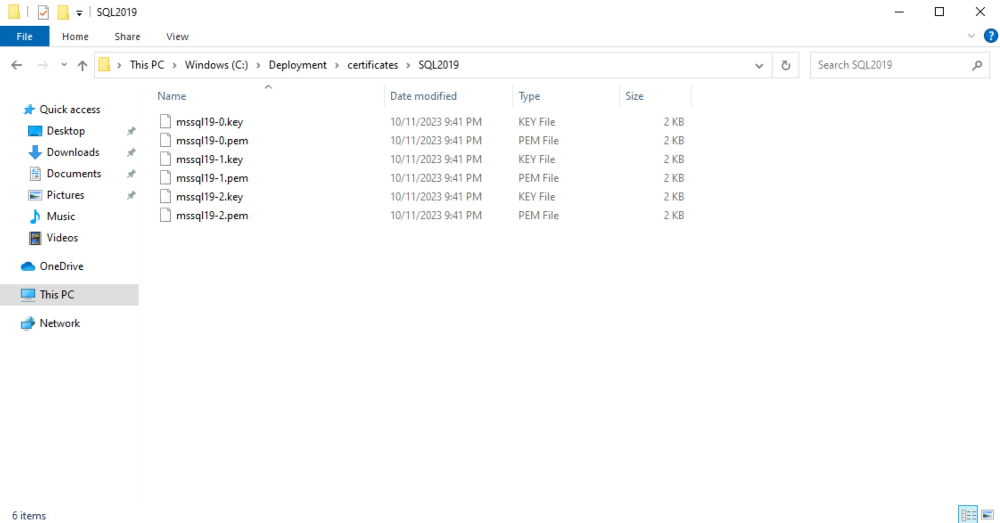
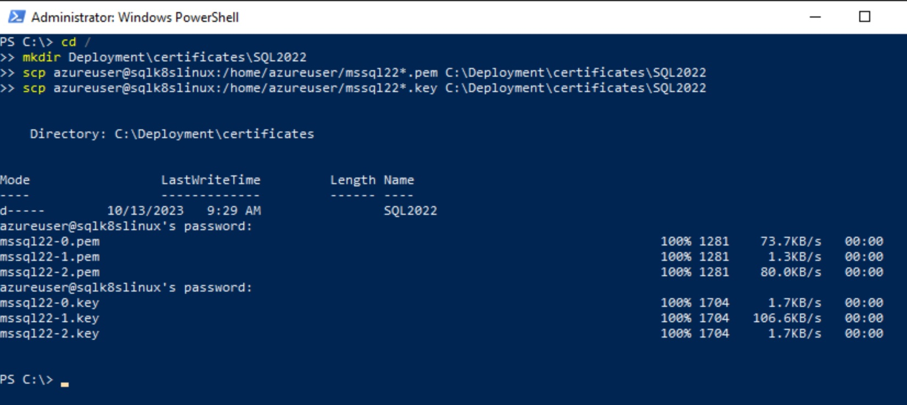
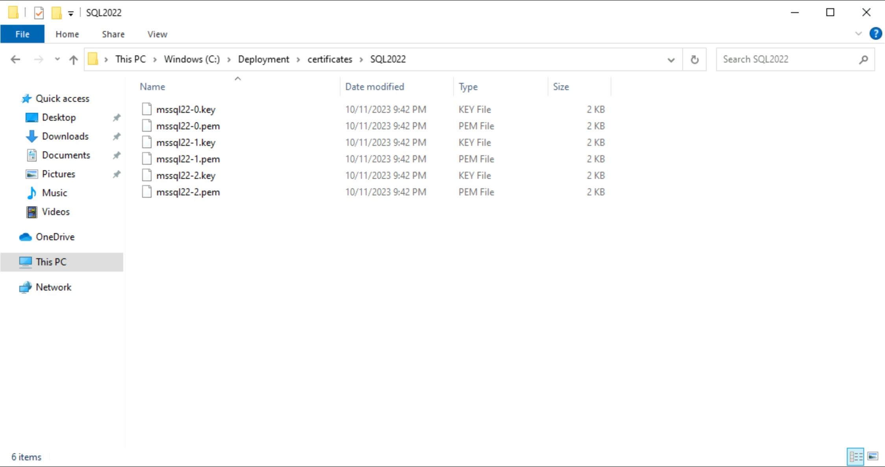
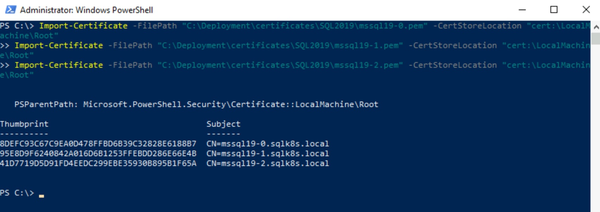
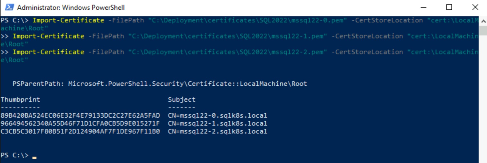
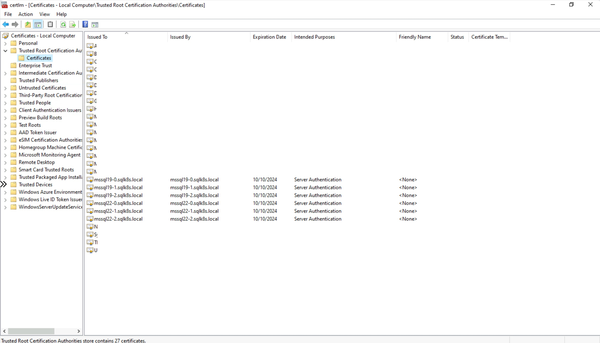

# Setup Channel Encryption (Encryption in Transit)

[< Previous Module](../modules/kerberos.md) - **[Home](../README.md)** - [Next Module >](../modules/sql19.md)

## Create and download TLS Certificate from SqlK8sLinux

1. Connect to SqlK8sJumpbox via Bastion (using domain account i.e. \<adminUsername\>\@sqlk8s.local)

    

2. Open Putty

    

3. Connect to 10.\<IP Address Value\>.16.5 (SqlK8sLinux) using \<adminUsername\> and \<adminPassword\>

    

    **NB: You can accept the alert message that will popup when connecting for the first time.**

    

    

4. Get the latest updates

    ```text
    sudo apt-get update -y
    ```

    

5. Create the certificate and private key files that will expire after 1 year

    For SQL Server 2019

    ```text
    openssl req -x509 -nodes -newkey rsa:2048 -subj '/CN=mssql19-0.sqlk8s.local' -addext "subjectAltName = DNS:mssql19-0.sqlk8s.local, DNS:mssql19-agl1.sqlk8s.local" -addext "extendedKeyUsage=1.3.6.1.5.5.7.3.1" -addext "keyUsage=keyEncipherment" -keyout mssql19-0.key -out mssql19-0.pem -days 365
    ```

    ```text
    openssl req -x509 -nodes -newkey rsa:2048 -subj '/CN=mssql19-1.sqlk8s.local' -addext "subjectAltName = DNS:mssql19-1.sqlk8s.local, DNS:mssql19-agl1.sqlk8s.local" -addext "extendedKeyUsage=1.3.6.1.5.5.7.3.1" -addext "keyUsage=keyEncipherment" -keyout mssql19-1.key -out mssql19-1.pem -days 365
    ```

    ```text
    openssl req -x509 -nodes -newkey rsa:2048 -subj '/CN=mssql19-2.sqlk8s.local' -addext "subjectAltName = DNS:mssql19-2.sqlk8s.local, DNS:mssql19-agl1.sqlk8s.local" -addext "extendedKeyUsage=1.3.6.1.5.5.7.3.1" -addext "keyUsage=keyEncipherment" -keyout mssql19-2.key -out mssql19-2.pem -days 365
    ```

    For SQL Server 2022

    ```text
    openssl req -x509 -nodes -newkey rsa:2048 -subj '/CN=mssql22-0.sqlk8s.local' -addext "subjectAltName = DNS:mssql22-0.sqlk8s.local, DNS:mssql22-agl1.sqlk8s.local" -addext "extendedKeyUsage=1.3.6.1.5.5.7.3.1" -addext "keyUsage=keyEncipherment" -keyout mssql22-0.key -out mssql22-0.pem -days 365
    ```

    ```text
    openssl req -x509 -nodes -newkey rsa:2048 -subj '/CN=mssql22-1.sqlk8s.local' -addext "subjectAltName = DNS:mssql22-1.sqlk8s.local, DNS:mssql22-agl1.sqlk8s.local" -addext "extendedKeyUsage=1.3.6.1.5.5.7.3.1" -addext "keyUsage=keyEncipherment" -keyout mssql22-1.key -out mssql22-1.pem -days 365
    ```

    ```text
    openssl req -x509 -nodes -newkey rsa:2048 -subj '/CN=mssql22-2.sqlk8s.local' -addext "subjectAltName = DNS:mssql22-2.sqlk8s.local, DNS:mssql22-agl1.sqlk8s.local" -addext "extendedKeyUsage=1.3.6.1.5.5.7.3.1" -addext "keyUsage=keyEncipherment" -keyout mssql22-2.key -out mssql22-2.pem -days 365
    ```

    

    

6. Open Powershell

    

7. Copy the files from SqlK8sLinux to SqlK8sJumpbox

    For SQL Server 2019
    
    ```text
    cd /
    mkdir Deployment\certificates\SQL2019
    scp <adminUsername>@sqlk8slinux:/home/<adminUsername>/mssql19*.pem C:\Deployment\certificates\SQL2019\
    scp <adminUsername>@sqlk8slinux:/home/<adminUsername>/mssql19*.key C:\Deployment\certificates\SQL2019\
    ```

    For SQL Server 2022
    
    ```text
    cd /
    mkdir Deployment\certificates\SQL2022
    scp <adminUsername>@sqlk8slinux:/home/<adminUsername>/mssql22*.pem C:\Deployment\certificates\SQL2022
    scp <adminUsername>@sqlk8slinux:/home/<adminUsername>/mssql22*.key C:\Deployment\certificates\SQL2022
    ```

    If prompted to continue enter **yes**

    When prompted for the password enter \<adminPassword\>

    

    

    

    

8. Install the certificates on SqlK8sJumpbox

    For SQL Server 2019
    
    ```text
    Import-Certificate -FilePath "C:\Deployment\certificates\SQL2019\mssql19-0.pem" -CertStoreLocation "cert:\LocalMachine\Root"
    Import-Certificate -FilePath "C:\Deployment\certificates\SQL2019\mssql19-1.pem" -CertStoreLocation "cert:\LocalMachine\Root"
    Import-Certificate -FilePath "C:\Deployment\certificates\SQL2019\mssql19-2.pem" -CertStoreLocation "cert:\LocalMachine\Root"
    ```

    For SQL Server 2022
    
    ```text
    Import-Certificate -FilePath "C:\Deployment\certificates\SQL2022\mssql22-0.pem" -CertStoreLocation "cert:\LocalMachine\Root"
    Import-Certificate -FilePath "C:\Deployment\certificates\SQL2022\mssql22-1.pem" -CertStoreLocation "cert:\LocalMachine\Root"
    Import-Certificate -FilePath "C:\Deployment\certificates\SQL2022\mssql22-2.pem" -CertStoreLocation "cert:\LocalMachine\Root"
    ```

    

    

    

[Continue >](../modules/sql19.md)
