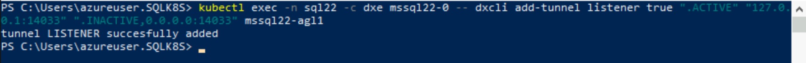
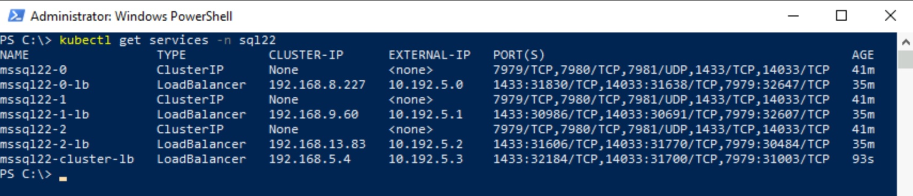
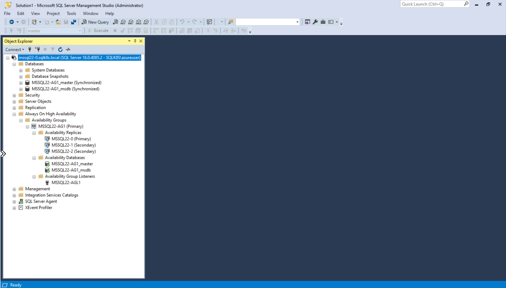
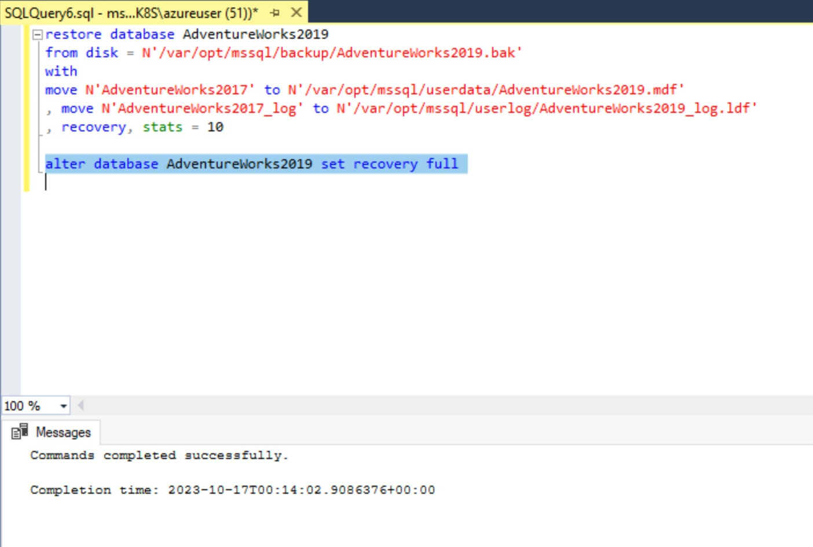
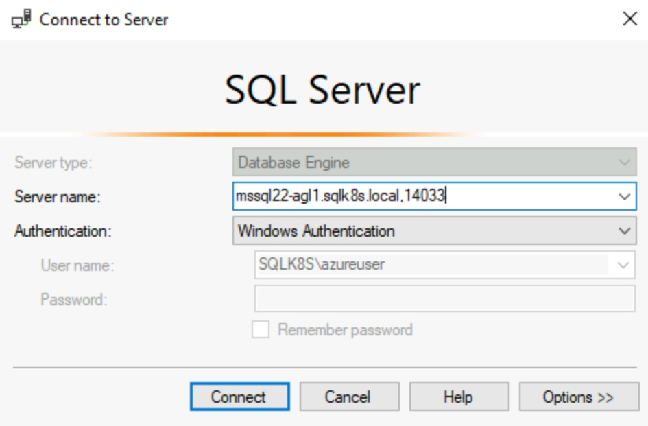

# Create Always-on Contained Availability Group

[< Previous Module](../modules/sql22.md) - **[Home](../README.md)** - [Next Module >](../modules/logins.md)

## Install and configure Contained Availability Group using DxEnterprise

For this solution, you will be using DxEnterprise which is a licensed product from DH2I.  For more information refer to https://support.dh2i.com/docs/guides/dxenterprise/containers/kubernetes/mssql-ag-k8s-statefulset-qsg/.

The first thing you will need to do is obtain a license to use the DxEnterprise software.  For the purpose of testing / proof of concepts you can register and download a development license from https://dh2i.com/trial/.

1. Connect to SqlK8sJumpbox via Bastion (using domain account i.e. \<azureUser\>.sqlk8s.local)

    

2. Open Powershell

    

3. Login to Azure AD with an account that has ownership permissions to your subscription

    ```text
    az login
    ```

    

    

    

4. Activate cluster licensing software (developer in this case) on each pod

    ```text
    kubectl exec -n sql22 -c dxe mssql22-0 -- dxcli activate-server <license key> --accept-eula
    ```

    ```text
    kubectl exec -n sql22 -c dxe mssql22-1 -- dxcli activate-server <license key> --accept-eula
    ```

    ```text
    kubectl exec -n sql22 -c dxe mssql22-2 -- dxcli activate-server <license key> --accept-eula
    ```

    

5. Add a VHost with the name of the listener on the first pod

    ```text
    kubectl exec -n sql22 -c dxe mssql22-0 -- dxcli cluster-add-vhost mssql22-agl1 *127.0.0.1 mssql22-0
    ```

    

6. Encrypt sa password for cluster software on the first pod (value returned will be \<EncryptedPassword\>)

    ```text
    kubectl exec -n sql22 -c dxe mssql22-0 -- dxcli encrypt-text <azurePassword>
    ```

    

7. Create the Contained Availability Group on the first pod

    **NB: This is done by adding an extra \"CONTAINED\" optional parameter.  Allow 1 minute for the availability group to be created with 2 new synchronized databases**

    ```text
    kubectl exec -n sql22 -c dxe mssql22-0 -- dxcli add-ags mssql22-agl1 mssql22-ag1 "mssql22-0|mssqlserver|sa|<EncryptedPassword>|5022|synchronous_commit|0" "CONTAINED"
    ```

    

8. Set the cluster passkey using \<azurePassword\> for consistency

    ```text
    kubectl exec -n sql22 -c dxe mssql22-0 -- dxcli cluster-set-secret-ex <azurePassword>
    ```

    

9. Enable vhost lookup in DxEnterprise's global settings

    ```text
    kubectl exec -n sql22 -c dxe mssql22-0 -- dxcli set-globalsetting membername.lookup true
    ```

    

10. Join second pod to cluster

    ```text
    kubectl exec -n sql22 -c dxe mssql22-1 -- dxcli join-cluster-ex mssql22-0 <azurePassword>
    ```

    

11. Join second pod to Availability Group

    **NB: Allow 1 minute for the node to be added with 2 new synchronized databases**

    ```text
    kubectl exec -n sql22 -c dxe mssql22-1 -- dxcli add-ags-node mssql22-agl1 mssql22-ag1 "mssql22-1|mssqlserver|sa|<EncryptedPassword>|5022|synchronous_commit|0"
    ```

    

12. Join third pod to cluster

    ```text
    kubectl exec -n sql22 -c dxe mssql22-2 -- dxcli join-cluster-ex mssql22-0 <azurePassword>
    ```

    

13. Join third pod to Availability Group

    **NB: Allow 1 minute for the node to be added with 2 new synchronized databases**

    ```text
    kubectl exec -n sql22 -c dxe mssql22-2 -- dxcli add-ags-node mssql22-agl1 mssql22-ag1 "mssql22-2|mssqlserver|sa|<EncryptedPassword>|5022|synchronous_commit|0"
    ```

    

14. Create Listener Tunnel

    ```text
    kubectl exec -n sql22 -c dxe mssql22-0 -- dxcli add-tunnel listener true ".ACTIVE" "127.0.0.1:14033" ".INACTIVE,0.0.0.0:14033" mssql22-agl1
    ```

    

15. Set Availability Group listener port (14033)

    ```text
    kubectl exec -n sql22 -c dxe mssql22-0 -- dxcli add-ags-listener mssql22-agl1 mssql22-ag1 14033
    ```

    

16. Add loadbalancer for listener

    ```text
    kubectl apply -f C:\SQLServerk8s-main\yaml\SQLContainerDeployment\SQL2022\service.yaml -n sql22
    ```

    

17. Check listener service is available

    ```text
    kubectl get services -n sql22
    ```

    

18. Copy AdventureWorks2019.bak to first pod

    ```text
    kubectl cp \..\SQLBackups\AdventureWorks2019.bak mssql22-0:/var/opt/mssql/backup/AdventureWorks2019.bak -n sql22
    ```

    

19. Open SQL Server Management Studio

    

20. Connect to mssql22-0

    

21. Verify the Availability Group is available and there are 2 synchronized databases (MSSQL22-AG1_master and MSSQL22-AG1_msdb)

    

22. Restore AdventureWorks2019 using T-SQL

    ```text
    restore database AdventureWorks2019
    from disk = N'/var/opt/mssql/backup/AdventureWorks2019.bak'
    with
    move N'AdventureWorks2019' to N'/var/opt/mssql/userdata/AdventureWorks2019.mdf'
    , move N'AdventureWorks2019_log' to N'/var/opt/mssql/userlog/AdventureWorks2019_log.ldf'
    , recovery, stats = 10
    ```

    


23. Set the database recovery to full

    ```text
    alter database AdventureWorks2019 set recovery full
    ```

    

24. Take a fresh full backup

    ```text
    backup database AdventureWorks2019
    to disk = N'/var/opt/mssql/backup/AdventureWorks2019_Full_Recovery.bak'
    with format, init, compression, stats = 10
    ```

    

25. Switch back to Powershell and add the database to Availability Group

    ```text
    kubectl exec -n sql22 -c dxe mssql22-0 -- dxcli add-ags-databases mssql22-agl1 mssql22-ag1 AdventureWorks2019
    ```

    

26. Verify Availability Group State

    ```text
    kubectl exec -n sql22 -c dxe mssql22-0 -- dxcli get-ags-detail mssql22-agl1 mssql22-ag1
    ```

    

27. Connect to the listener from SQL Server Management Studio (mssql22-agl1,14033 or mssql22-agl1.sqlk8s.local,14033)

    **NB: You will notice there is no Availability Group option when connected to the listener, and there is only 1 database (AdventureWorks2019) which is not synchronized.  However, mssql-0 shows 3 synchronized databases.  This is by design, with Contained Availability Groups, the listener appears as a standalone instance.  The availability group is under the hood.**

    **NB: You can still check which instance is primary by connecting to the 3 instances and expanding every folder from \"Always On High Availability\".**

    

    

28. Try failing over the database by deleting mssql22-0 and check which pod becomes the new primary by refreshing the listener

    ```text
    kubectl delete pod mssql22-0 -n sql22
    ```

    

[Continue >](../modules/logins.md)
