# Setup Windows Authentication (Kerberos)

[< Previous Module](../modules/setup.md) - **[Home](../README.md)** - [Next Module >](../modules/sql19.md)

## Join SqlK8sLinux to the SqlK8s domain

1. Connect to SqlK8sJumpbox via Bastion (using domain account i.e. \<adminUsername\>\@sqlk8s.local)

    

2. Open Putty

    

3. Connect to 10.\<IP Address Value\>.16.5 (SqlK8sLinux) using \<adminUsername\> and \<adminPassword\>

    

    **NB: You can accept the alert message that will popup.**

    

    

4. Get the latest updates

    ```text
    sudo apt-get update -y
    ```

    

5. Install resolvconf

    ```text
    sudo apt-get install resolvconf
    ```

    

6. Add dns nameserver to resolvconf configuration file

    ```text
    sudo nano /etc/resolvconf/resolv.conf.d/head
    ```

    Add **nameserver 10.\<IP Address Value\>.16.4** (SqlK8sDC) to the bottom of the file and then press **Ctrl + X** followed by **Y** and **Enter** to save the file

    

7. Enable the resolvconf service

    ```text
    sudo systemctl enable --now resolvconf.service
    ```

    

8. Install dependencies for joining SqlK8sLinux to the domain (realm)

    ```text
    sudo apt-get install -y realmd krb5-user software-properties-common packagekit sssd sssd-tools
    ```

    

    When prompted for the realm enter **SQLK8S.LOCAL**

    

9. Update krb5.conf file to disable rdns under default realm

    ```text
    sudo nano /etc/krb5.conf
    ```

    Add **rdns = false** on a new line under default_realm in the \[libdefaults\] section and then press `Ctrl + X` followed by `Y` and `Enter` to save the file

    

10. Join SqlK8SLinux to the domain (realm) using your \<adminUsername\> username

    ```text
    sudo realm join sqlk8s.local -U '<adminUsername>@SQLK8S.LOCAL' -v
    ```

    When prompted enter the \<adminPassword\>    

    

## Create DNS, Service Accounts and Service Principal Names (SPNs) on SqlK8sDC

1. Connect to SqlK8sDC using AD Credentials

    

2. Open Powershell as Administrator

    

3. Add DNS entry for SqlK8sLinux

    ```text
    Add-DnsServerResourceRecordA -Name "SqlK8sLinux" -ZoneName "sqlk8s.local" -IPv4Address "10.<IP Address Value>.16.5" -TimeToLive "00:20:00"
    ```

    

4. Create new AD account that will be the privileged AD account for the SQL Server Pods (keep service account in lower case)

    For SQL Server 2019

    ```text
    New-ADUser sqlk8ssvc19 -AccountPassword (Read-Host -AsSecureString "Enter Password") -PasswordNeverExpires $true -Enabled $true -KerberosEncryptionType AES256
    ```

    For SQL Server 2022

    ```text
    New-ADUser sqlk8ssvc22 -AccountPassword (Read-Host -AsSecureString "Enter Password") -PasswordNeverExpires $true -Enabled $true -KerberosEncryptionType AES256
    ```

    When prompted provide the \<adminPassword\> for consistency

    **NB: The account will have AES256 enabled as the KerberosEncryptionType so it can be used for setting up Service Principal Names (SPNs) on Linux Containers**

    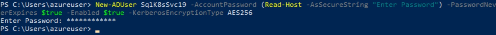

    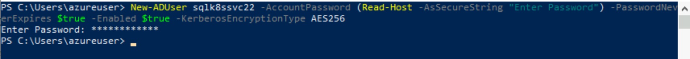

5. Create all of the required SPNs for each SQL Pod instance and the availability group listener

    For SQL Server 2019
    
    ```text
    setspn -S MSSQLSvc/mssql19-0.sqlk8s.local SQLK8S\sqlk8ssvc19
    setspn -S MSSQLSvc/mssql19-1.sqlk8s.local SQLK8S\sqlk8ssvc19
    setspn -S MSSQLSvc/mssql19-2.sqlk8s.local SQLK8S\sqlk8ssvc19
    setspn -S MSSQLSvc/mssql19-0.sqlk8s.local:1433 SQLK8S\sqlk8ssvc19
    setspn -S MSSQLSvc/mssql19-1.sqlk8s.local:1433 SQLK8S\sqlk8ssvc19
    setspn -S MSSQLSvc/mssql19-2.sqlk8s.local:1433 SQLK8S\sqlk8ssvc19
    setspn -S MSSQLSvc/mssql19-0:1433 SQLK8S\sqlk8ssvc19
    setspn -S MSSQLSvc/mssql19-1:1433 SQLK8S\sqlk8ssvc19
    setspn -S MSSQLSvc/mssql19-2:1433 SQLK8S\sqlk8ssvc19
    setspn -S MSSQLSvc/mssql19-0 SQLK8S\sqlk8ssvc19
    setspn -S MSSQLSvc/mssql19-1 SQLK8S\sqlk8ssvc19
    setspn -S MSSQLSvc/mssql19-2 SQLK8S\sqlk8ssvc19
    setspn -S MSSQLSvc/mssql19-agl1.sqlk8s.local:14033 SQLK8S\sqlk8ssvc19
    setspn -S MSSQLSvc/mssql19-agl1:14033 SQLK8S\sqlk8ssvc19
    setspn -l SQLK8S\sqlk8ssvc19
    ```

    For SQL Server 2022
    
    ```text
    setspn -S MSSQLSvc/mssql22-0.sqlk8s.local SQLK8S\sqlk8ssvc22
    setspn -S MSSQLSvc/mssql22-1.sqlk8s.local SQLK8S\sqlk8ssvc22
    setspn -S MSSQLSvc/mssql22-2.sqlk8s.local SQLK8S\sqlk8ssvc22
    setspn -S MSSQLSvc/mssql22-0.sqlk8s.local:1433 SQLK8S\sqlk8ssvc22
    setspn -S MSSQLSvc/mssql22-1.sqlk8s.local:1433 SQLK8S\sqlk8ssvc22
    setspn -S MSSQLSvc/mssql22-2.sqlk8s.local:1433 SQLK8S\sqlk8ssvc22
    setspn -S MSSQLSvc/mssql22-0:1433 SQLK8S\sqlk8ssvc22
    setspn -S MSSQLSvc/mssql22-1:1433 SQLK8S\sqlk8ssvc22
    setspn -S MSSQLSvc/mssql22-2:1433 SQLK8S\sqlk8ssvc22
    setspn -S MSSQLSvc/mssql22-0 SQLK8S\sqlk8ssvc22
    setspn -S MSSQLSvc/mssql22-1 SQLK8S\sqlk8ssvc22
    setspn -S MSSQLSvc/mssql22-2 SQLK8S\sqlk8ssvc22
    setspn -S MSSQLSvc/mssql22-agl1.sqlk8s.local:14033 SQLK8S\sqlk8ssvc22
    setspn -S MSSQLSvc/mssql22-agl1:14033 SQLK8S\sqlk8ssvc22
    setspn -l SQLK8S\sqlk8ssvc22
    ```

    **NB: The listener will run under port 14033**

    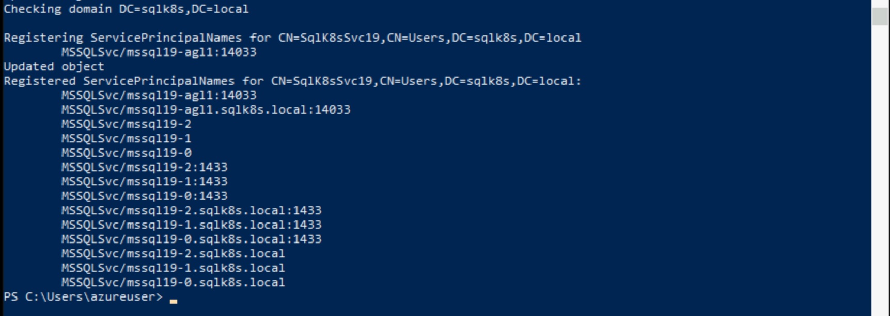

    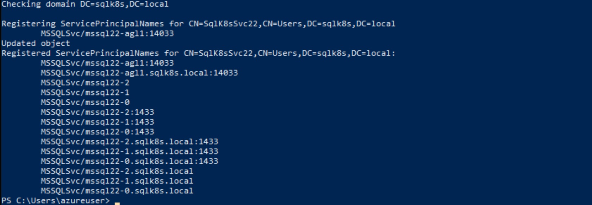

6. Add DNS entries for all 3 sql instances, the availability group listener, and the monitoring tools (will be deployed later)

    For SQL Server 2019

    ```text
    Add-DnsServerResourceRecordA -Name "mssql19-0" -ZoneName "sqlk8s.local" -IPv4Address "10.<IP Address Value>.4.0" -TimeToLive "00:20:00"
    ```

    ```text
    Add-DnsServerResourceRecordA -Name "mssql19-1" -ZoneName "sqlk8s.local" -IPv4Address "10.<IP Address Value>.4.1" -TimeToLive "00:20:00"
    ```

    ```text
    Add-DnsServerResourceRecordA -Name "mssql19-2" -ZoneName "sqlk8s.local" -IPv4Address "10.<IP Address Value>.4.2" -TimeToLive "00:20:00"
    ```

    ```text
    Add-DnsServerResourceRecordA -Name "mssql19-agl1" -ZoneName "sqlk8s.local" -IPv4Address "10.<IP Address Value>.4.3" -TimeToLive "00:20:00"
    ```

    For SQL Server 2022

    ```text
    Add-DnsServerResourceRecordA -Name "mssql22-0" -ZoneName "sqlk8s.local" -IPv4Address "10.<IP Address Value>.5.0" -TimeToLive "00:20:00"
    ```

    ```text
    Add-DnsServerResourceRecordA -Name "mssql22-1" -ZoneName "sqlk8s.local" -IPv4Address "10.<IP Address Value>.5.1" -TimeToLive "00:20:00"
    ```

    ```text
    Add-DnsServerResourceRecordA -Name "mssql22-2" -ZoneName "sqlk8s.local" -IPv4Address "10.<IP Address Value>.5.2" -TimeToLive "00:20:00"
    ```

    ```text
    Add-DnsServerResourceRecordA -Name "mssql22-agl1" -ZoneName "sqlk8s.local" -IPv4Address "10.<IP Address Value>.5.3" -TimeToLive "00:20:00"
    ```

    For SQL Server Monitor

    ```text
    Add-DnsServerResourceRecordA -Name "influxdb" -ZoneName "sqlk8s.local" -IPv4Address "10.<IP Address Value>.6.0" -TimeToLive "00:20:00"
    ```

    ```text
    Add-DnsServerResourceRecordA -Name "grafana" -ZoneName "sqlk8s.local" -IPv4Address "10.<IP Address Value>.6.1" -TimeToLive "00:20:00"
    ```

    

    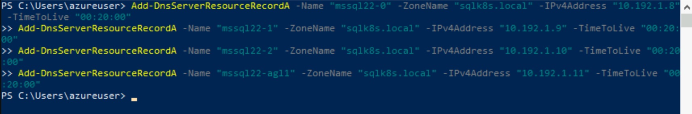

    

## Generate and download Kerberos keytab files

1. Connect to SqlK8sJumpbox, open Putty, and connect to 10.\<IP Address Value\>.16.5 (SqlK8sLinux)

    

2. Import the public repository GPG keys and then register the Microsoft Ubuntu repository

    ```text
    curl https://packages.microsoft.com/keys/microsoft.asc | sudo apt-key add -
    ```

    

    ```text
    sudo curl https://packages.microsoft.com/config/ubuntu/18.04/prod.list | sudo tee /etc/apt/sources.list.d/msprod.list
    ```

    

3. Remove any older adutil packages

    ```text
    sudo apt-get remove adutil-preview
    ```

    

4. Get the latest updates

    ```text
    sudo apt-get update
    ```

    

5. Install adutil using ACCEPT_EULA=Y to accept the EULA for adutil (the EULA is placed at the path /usr/share/adutil/)

    ```text
    sudo ACCEPT_EULA=Y apt-get install -y adutil
    ```

    

6. Obtain or renew the Kerberos TGT (ticket-granting ticket) using the kinit command with your preconfigured \<adminUsername\> (you will be prompted for the password)

    ```text
    kinit <adminUsername>@SQLK8S.LOCAL
    ```

    When prompted enter the \<adminPassword\>

    

7. Create SPN keytab file for each Pod encrypted using AES256 (when prompted enter **y** and then **1** for AES256)

    For SQL Server 2019
    
    ```text
    adutil keytab createauto -k mssql_mssql19-0.keytab -p 1433 -H mssql19-0.sqlk8s.local --password <adminPassword> -s MSSQLSvc
    ```

    ```text
    adutil keytab createauto -k mssql_mssql19-1.keytab -p 1433 -H mssql19-1.sqlk8s.local --password <adminPassword> -s MSSQLSvc
    ```

    ```text
    adutil keytab createauto -k mssql_mssql19-2.keytab -p 1433 -H mssql19-2.sqlk8s.local --password <adminPassword> -s MSSQLSvc
    ```

    For SQL Server 2022
    
    ```text
    adutil keytab createauto -k mssql_mssql22-0.keytab -p 1433 -H mssql22-0.sqlk8s.local --password <adminPassword> -s MSSQLSvc
    ```

    ```text
    adutil keytab createauto -k mssql_mssql22-1.keytab -p 1433 -H mssql22-1.sqlk8s.local --password <adminPassword> -s MSSQLSvc
    ```

    ```text
    adutil keytab createauto -k mssql_mssql22-2.keytab -p 1433 -H mssql22-2.sqlk8s.local --password <adminPassword> -s MSSQLSvc
    ```

    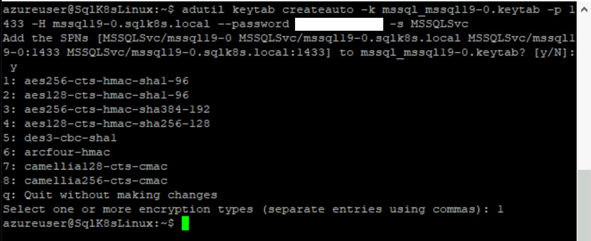

    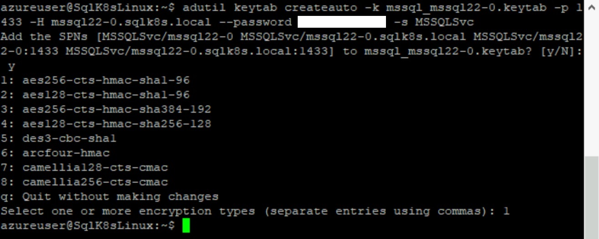

8. Append each file with AD Account info (enter **1** for AES256)

    For SQL Server 2019
    
    ```text
    adutil keytab create -k mssql_mssql19-0.keytab -p sqlk8ssvc19 --password <adminPassword>
    ```

    ```text
    adutil keytab create -k mssql_mssql19-1.keytab -p sqlk8ssvc19 --password <adminPassword>
    ```

    ```text
    adutil keytab create -k mssql_mssql19-2.keytab -p sqlk8ssvc19 --password <adminPassword>
    ```

    For SQL Server 2022
    
    ```text
    adutil keytab create -k mssql_mssql22-0.keytab -p sqlk8ssvc22 --password <adminPassword>
    ```

    ```text
    adutil keytab create -k mssql_mssql22-1.keytab -p sqlk8ssvc22 --password <adminPassword>
    ```

    ```text
    adutil keytab create -k mssql_mssql22-2.keytab -p sqlk8ssvc22 --password <adminPassword>
    ```

    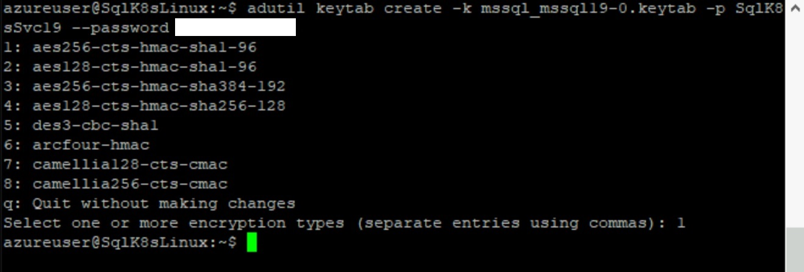

    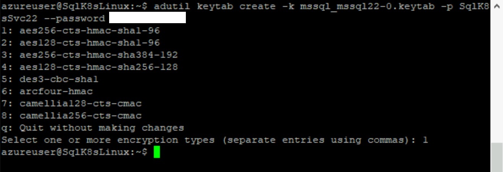

9. Open Powershell

    

10. Copy the files from SqlK8sLinux to SqlK8sJumpbox

    For SQL Server 2019
    
    ```text
    cd /
    mkdir Deployment\keytab\SQL2019
    scp <adminUsername>@sqlk8slinux:/home/<adminUsername>/mssql_mssql19* C:\Deployment\keytab\SQL2019\
    ```

    For SQL Server 2022
    
    ```text
    cd /
    mkdir Deployment\keytab\SQL2022
    scp <adminUsername>@sqlk8slinux:/home/<adminUsername>/mssql_mssql22* C:\Deployment\keytab\SQL2022
    ```

    When prompted to continue enter **yes**

    When prompted for the password enter \<adminPassword\>

    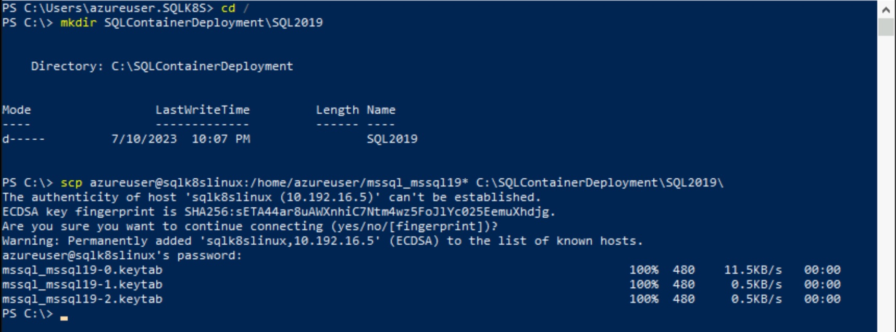

    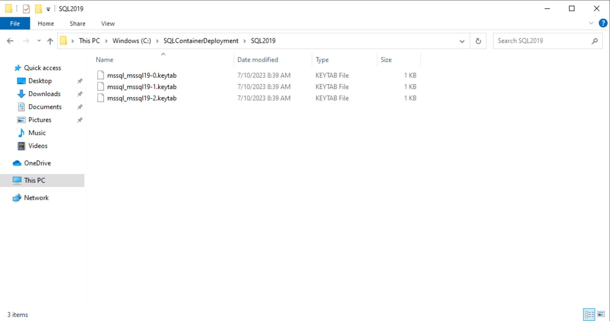

    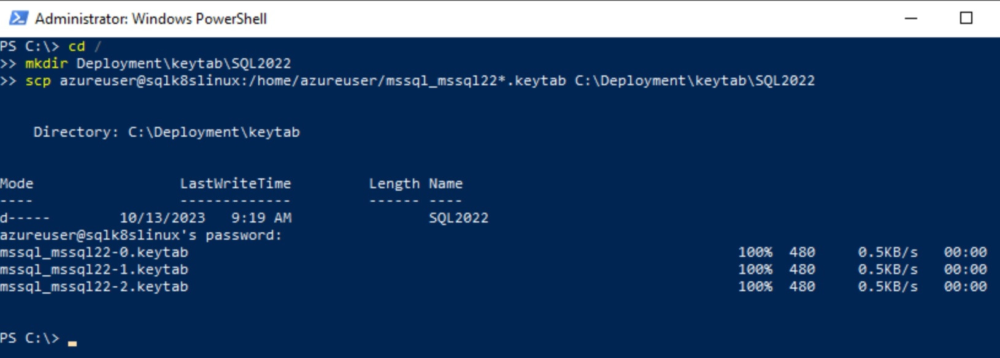

    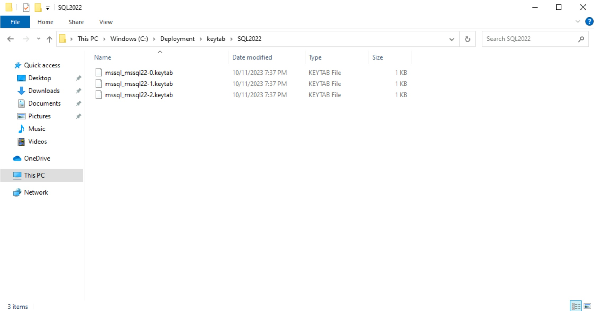

[Continue >](../modules/encryption.md)
