# Setup Windows Authentication (Kerberos) via Linux Server

[< Previous Module](../modules/setup.md) - **[Home](../README.md)** - [Next Module >](../modules/sql.md)

## Configure Network and DNS Settings on SqlK8sLinux

1. Connect to SqlK8sJumpbox via Bastion (using domain account i.e. \<azureUser\>.sqlk8s.local)

    

2. Open Putty

    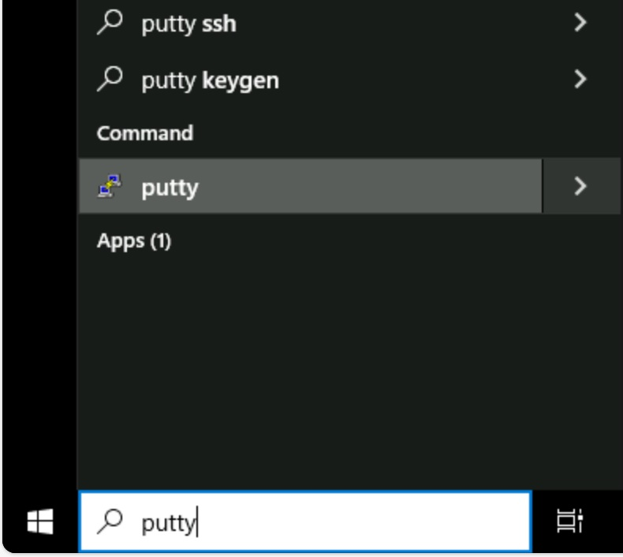

3. Connect to 10.192.4.5 (sqlK8sLinux) using preconfigured credentials

    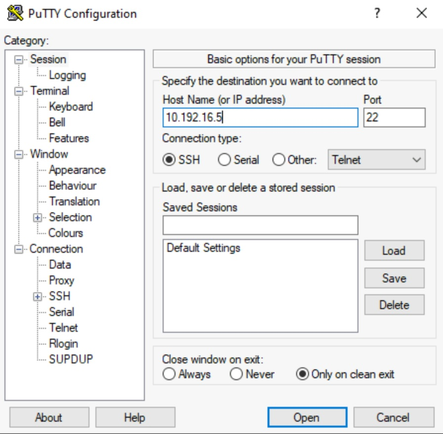

    **NB: You can accept the alert message that will popup.**

    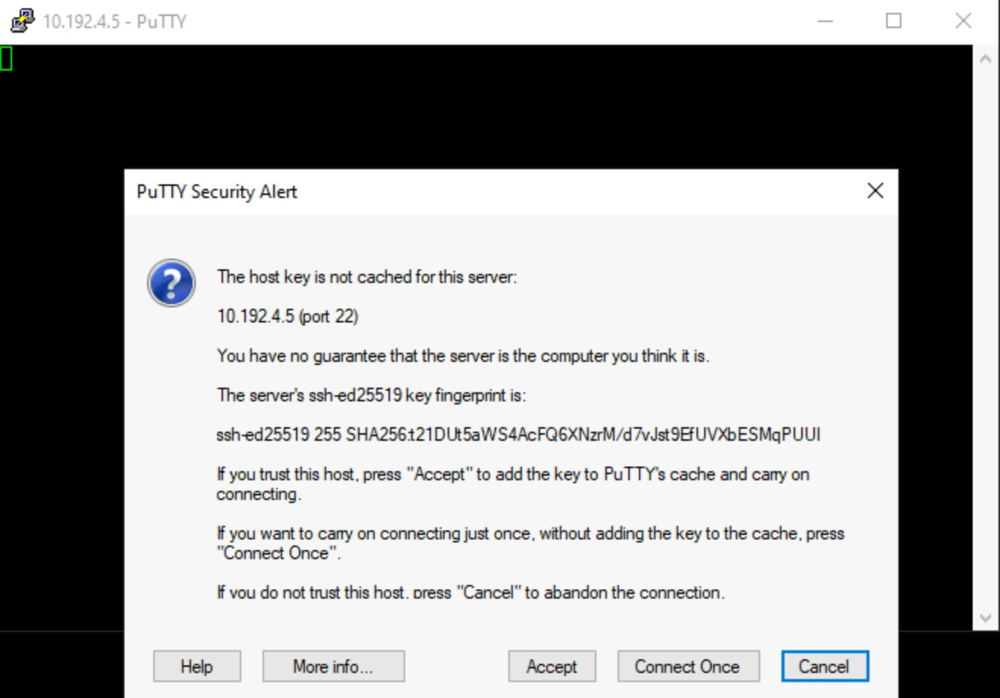

    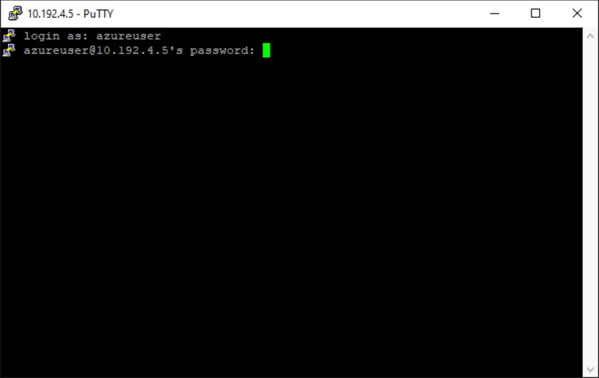

4. Get the latest updates

    ```text
    sudo apt-get update -y
    ```

    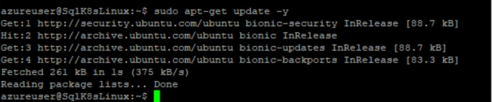

5. Install resolvconf

    ```text
    sudo apt-get install resolvconf
    ```

    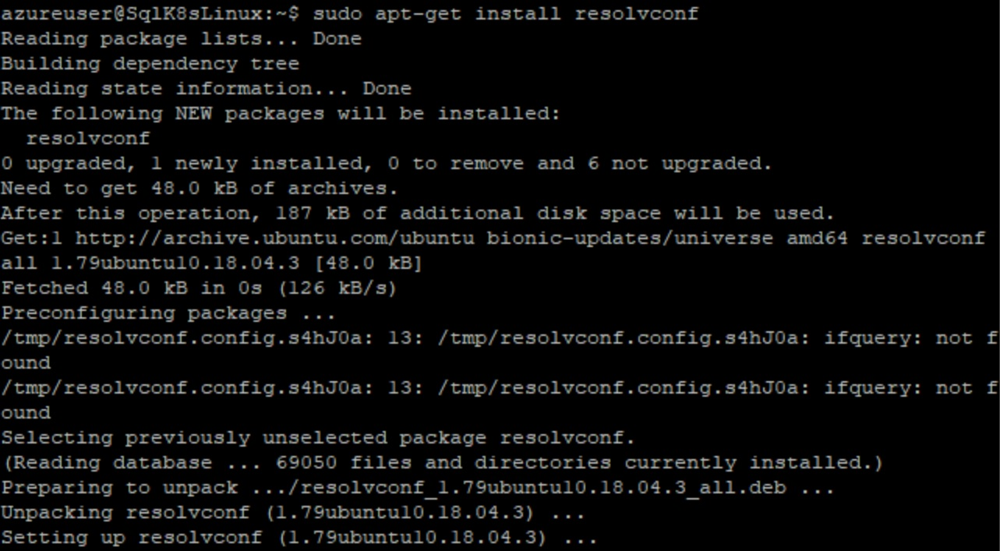

6. Add dns nameserver to resolvconf configuration file

    ```text
    sudo nano /etc/resolvconf/resolv.conf.d/head
    ```

    Add **nameserver 10.192.4.4** (SqlK8sDC) to the bottom of the file and then press `Ctrl + X` followed by `Y` and `Enter` to save the file

    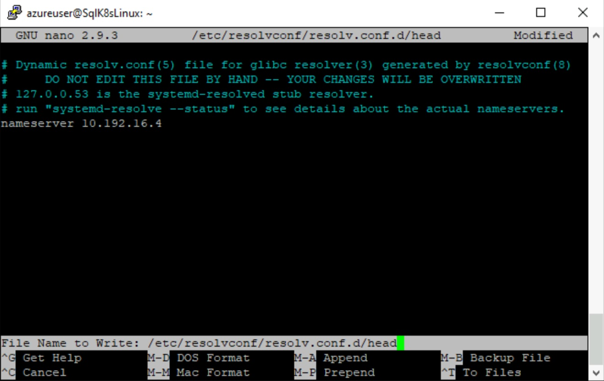

7. Enable the resolvconf service

    ```text
    sudo systemctl enable --now resolvconf.service
    ```

    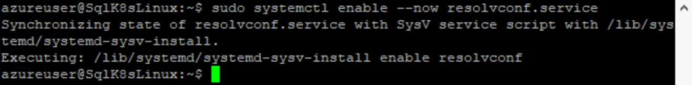

8. Install dependencies for joining SqlK8sLinux to the domain (realm)

    ```text
    sudo apt-get install -y realmd krb5-user software-properties-common packagekit sssd sssd-tools
    ```

    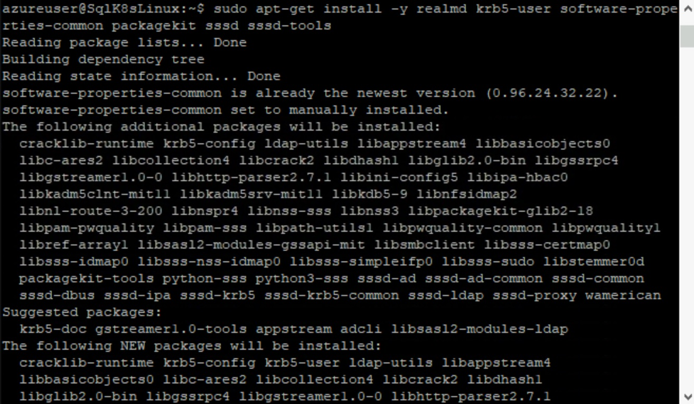

    When prompted for the realm enter **SQLK8S.LOCAL**

    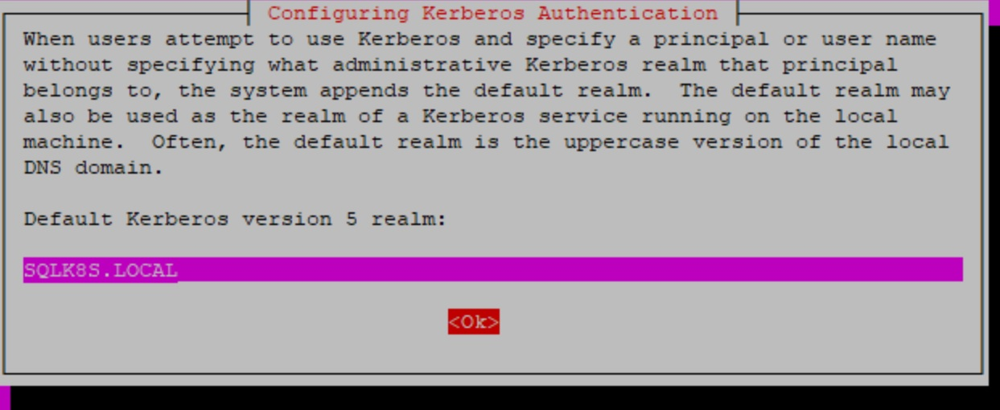

9. Update krb5.conf file to disable rdns under default realm

    ```text
    sudo nano /etc/krb5.conf
    ```

    Add **rdns = false** on a new line under default_realm in the \[libdefaults\] section and then press `Ctrl + X` followed by `Y` and `Enter` to save the file

    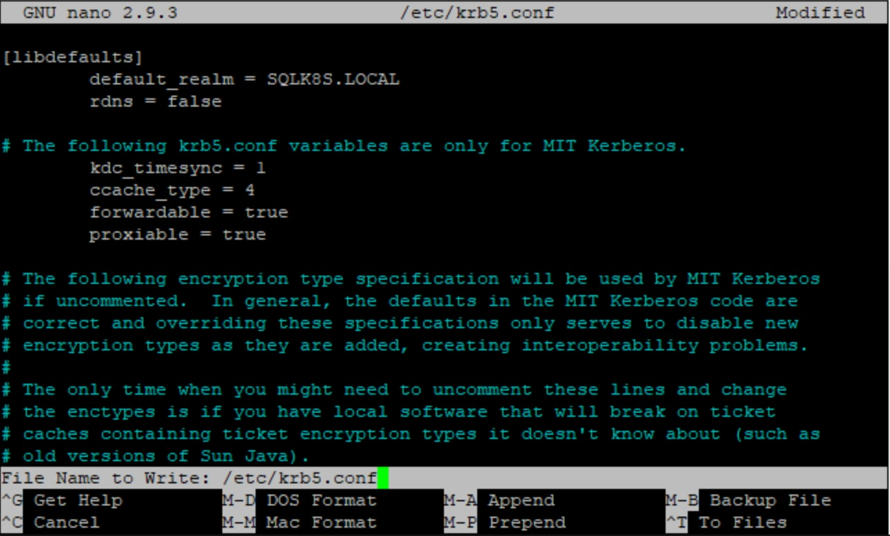

10. Join SqlK8SLinux to the domain (realm) using your azureUser username

    ```text
    sudo realm join sqlk8s.local -U '<azureUser>@SQLK8S.LOCAL' -v
    ```

    When prompted enter the \<azurePassword\>    

    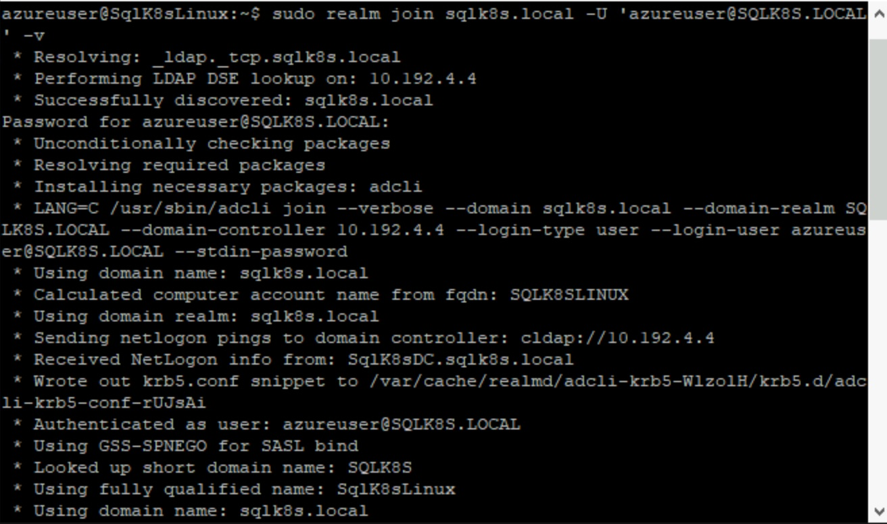

## Configure Kerberos on AKS Cluster using adutil on SqlK8sLinux

1. Connect to SqlK8sDC and open Powershell as Administrator

    

2. Open Powershell as Administrator

    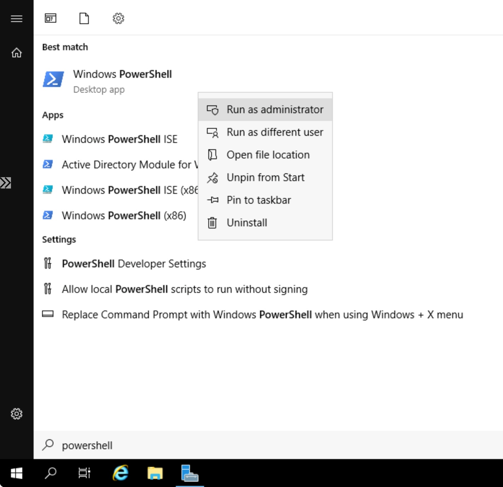

3. Add DNS entry for SqlK8sLinux

    ```text
    Add-DnsServerResourceRecordA -Name "SqlK8sLinux" -ZoneName "sqlk8s.local" -IPv4Address "10.192.4.5" -TimeToLive "00:20:00"
    ```

    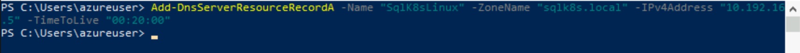

4. Create a new AD Account that will be the privileged AD account for SQL Server on each container

    ```text
    New-ADUser SqlK8sSvc -AccountPassword (Read-Host -AsSecureString "Enter Password") -PasswordNeverExpires $true -Enabled $true -KerberosEncryptionType AES256
    ```

    When prompted provide the \<azurePassword\> for consistency

    **NB: The account will have AES256 enabled as the KerberosEncryptionType so it can be used for setting up Service Principal Names (SPNs) on Linux Containers**

    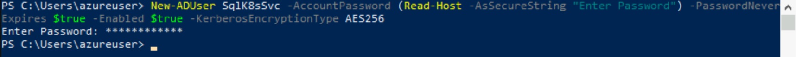

5. Create all of the required SPNs for each SQL Pod instance and the availability group listener

    ```text
    setspn -S MSSQLSvc/mssql-0.sqlk8s.local SQLK8S\SqlK8sSvc
    setspn -S MSSQLSvc/mssql-1.sqlk8s.local SQLK8S\SqlK8sSvc
    setspn -S MSSQLSvc/mssql-2.sqlk8s.local SQLK8S\SqlK8sSvc
    setspn -S MSSQLSvc/mssql-0.sqlk8s.local:1433 SQLK8S\SqlK8sSvc
    setspn -S MSSQLSvc/mssql-1.sqlk8s.local:1433 SQLK8S\SqlK8sSvc
    setspn -S MSSQLSvc/mssql-2.sqlk8s.local:1433 SQLK8S\SqlK8sSvc
    setspn -S MSSQLSvc/mssql-0:1433 SQLK8S\SqlK8sSvc
    setspn -S MSSQLSvc/mssql-1:1433 SQLK8S\SqlK8sSvc
    setspn -S MSSQLSvc/mssql-2:1433 SQLK8S\SqlK8sSvc
    setspn -S MSSQLSvc/mssql-0 SQLK8S\SqlK8sSvc
    setspn -S MSSQLSvc/mssql-1 SQLK8S\SqlK8sSvc
    setspn -S MSSQLSvc/mssql-2 SQLK8S\SqlK8sSvc
    setspn -S MSSQLSvc/mssql-agl1.sqlk8s.local SQLK8S\SqlK8sSvc
    setspn -S MSSQLSvc/mssql-agl1.sqlk8s.local:14033 SQLK8S\SqlK8sSvc
    setspn -S MSSQLSvc/mssql-agl1:14033 SQLK8S\SqlK8sSvc
    setspn -S MSSQLSvc/mssql-agl1 SQLK8S\SqlK8sSvc
    setspn -l SQLK8S\SqlK8sSvc
    ```

    **NB: The listener will run under port 14033**

    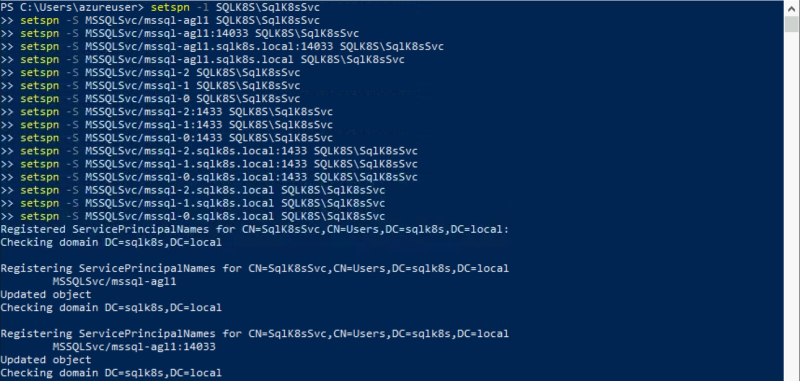

6. Add DNS entries for all 3 sql instances, the availability group listener, and the monitoring tools (will be deployed later)

    ```text
    Add-DnsServerResourceRecordA -Name "mssql-0" -ZoneName "sqlk8s.local" -IPv4Address "10.192.1.4" -TimeToLive "00:20:00"
    Add-DnsServerResourceRecordA -Name "mssql-1" -ZoneName "sqlk8s.local" -IPv4Address "10.192.1.5" -TimeToLive "00:20:00"
    Add-DnsServerResourceRecordA -Name "mssql-2" -ZoneName "sqlk8s.local" -IPv4Address "10.192.1.6" -TimeToLive "00:20:00"
    Add-DnsServerResourceRecordA -Name "mssql-agl1" -ZoneName "sqlk8s.local" -IPv4Address "10.192.1.7" -TimeToLive "00:20:00"
    Add-DnsServerResourceRecordA -Name "influxdb" -ZoneName "sqlk8s.local" -IPv4Address "10.192.1.8" -TimeToLive "00:20:00"
    Add-DnsServerResourceRecordA -Name "grafana" -ZoneName "sqlk8s.local" -IPv4Address "10.192.1.9" -TimeToLive "00:20:00"
    ```

    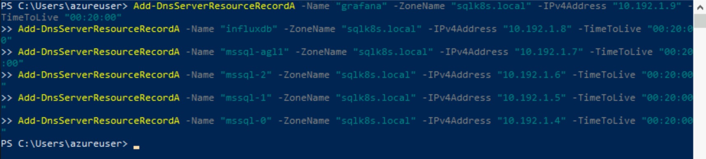

7. Connect to SqlK8sJumpbox, open Putty, and connect to 10.192.4.5 (SqlK8sLinux)

    

8. Import the public repository GPG keys and then register the Microsoft Ubuntu repository

    ```text
    curl https://packages.microsoft.com/keys/microsoft.asc | sudo apt-key add -
    ```

    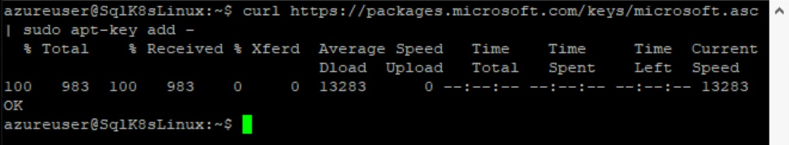

    ```text
    sudo curl https://packages.microsoft.com/config/ubuntu/18.04/prod.list | sudo tee /etc/apt/sources.list.d/msprod.list
    ```

    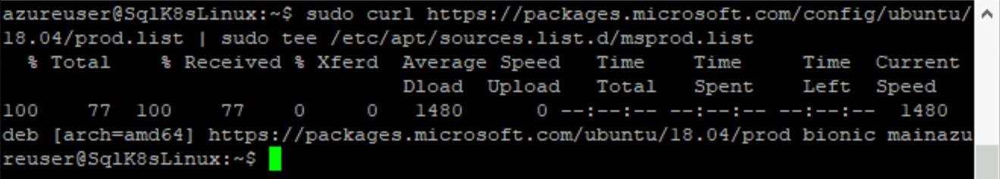

9. Remove any older adutil packages

    ```text
    sudo apt-get remove adutil-preview
    ```

    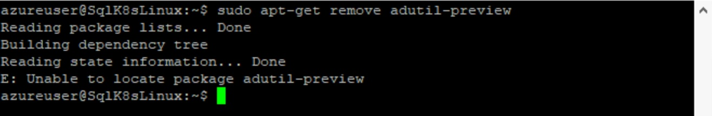

10. Get the latest updates

    ```text
    sudo apt-get update
    ```

    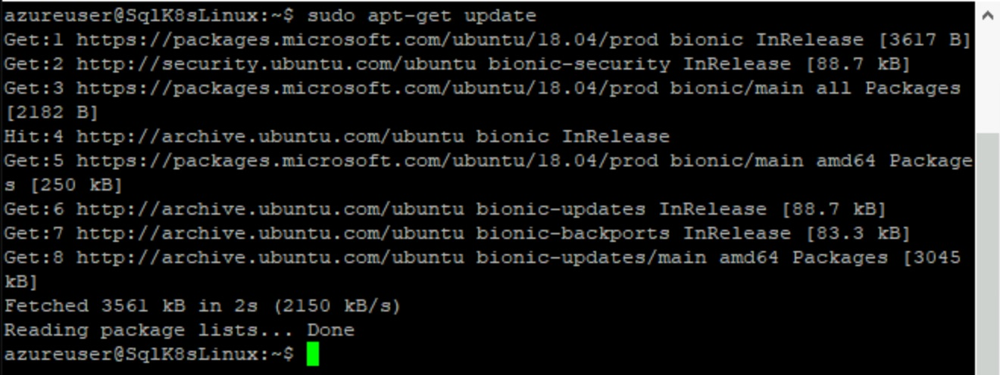

11. Install adutil using ACCEPT_EULA=Y to accept the EULA for adutil (the EULA is placed at the path /usr/share/adutil/)

    ```text
    sudo ACCEPT_EULA=Y apt-get install -y adutil
    ```

    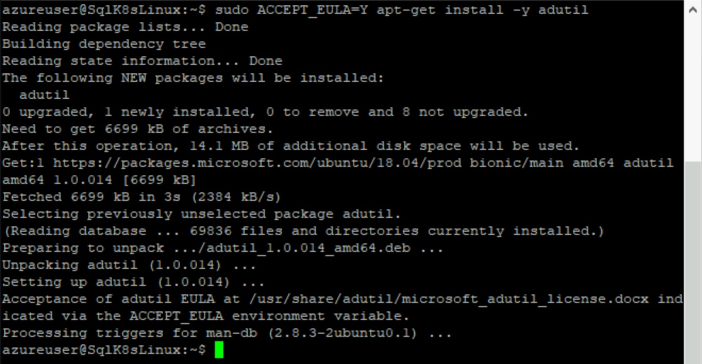

12. Obtain or renew the Kerberos TGT (ticket-granting ticket) using the kinit command with your preconfigured username (you will be prompted for the password)

    ```text
    kinit <azureUser>@SQLK8S.LOCAL
    ```

    When prompted enter the \<azurePassword\>

    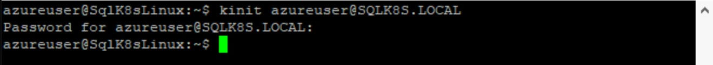

13. Create SPN keytab file for mssql-0 pod encrypted using AES256

    ```text
    adutil keytab createauto -k mssql_mssql-0.keytab -p 1433 -H mssql-0.sqlk8s.local --password <azurePassword> -s MSSQLSvc
    ```
    When prompted to add SPN enter `y`

    When prompted for the encryption type select `1` for AES256

    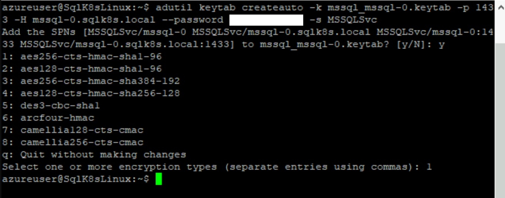

14. Repeat for mssql-1 and mssql-2

    ```text
    adutil keytab createauto -k mssql_mssql-1.keytab -p 1433 -H mssql-1.sqlk8s.local --password <azurePassword> -s MSSQLSvc
    ```

    ```text
    adutil keytab createauto -k mssql_mssql-2.keytab -p 1433 -H mssql-2.sqlk8s.local --password <azurePassword> -s MSSQLSvc
    ```

15. Append each file with AD Account info (select `1` for AES256)

    ```text
    adutil keytab create -k mssql_mssql-0.keytab -p SqlK8sSvc --password <azurePassword>
    ```

    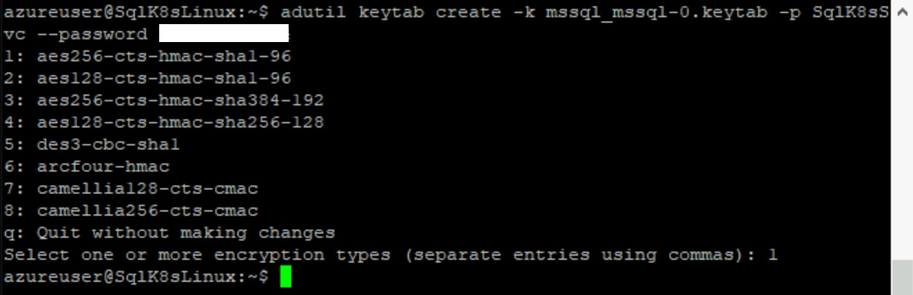

    ```text
    adutil keytab create -k mssql_mssql-1.keytab -p SqlK8sSvc --password <azurePassword>
    ```

    ```text
    adutil keytab create -k mssql_mssql-2.keytab -p SqlK8sSvc --password <azurePassword>
    ```

16. Open Powershell and copy the files from SqlK8sLinux to SqlK8sJumpbox

    ```text
    cd /
    mkdir SQLContainerDeployment\SQL2019
    scp azureuser@sqlk8slinux:/home/azureuser/* C:\SQLContainerDeployment\SQL2019\
    ```

    When prompted to continue enter `yes`

    When prompted for the password enter \<azurePassword\>

    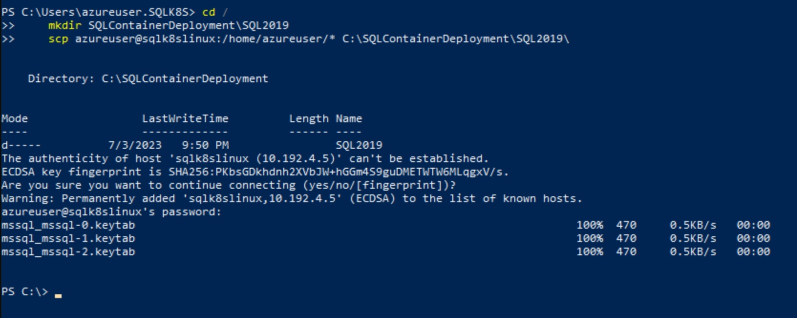

    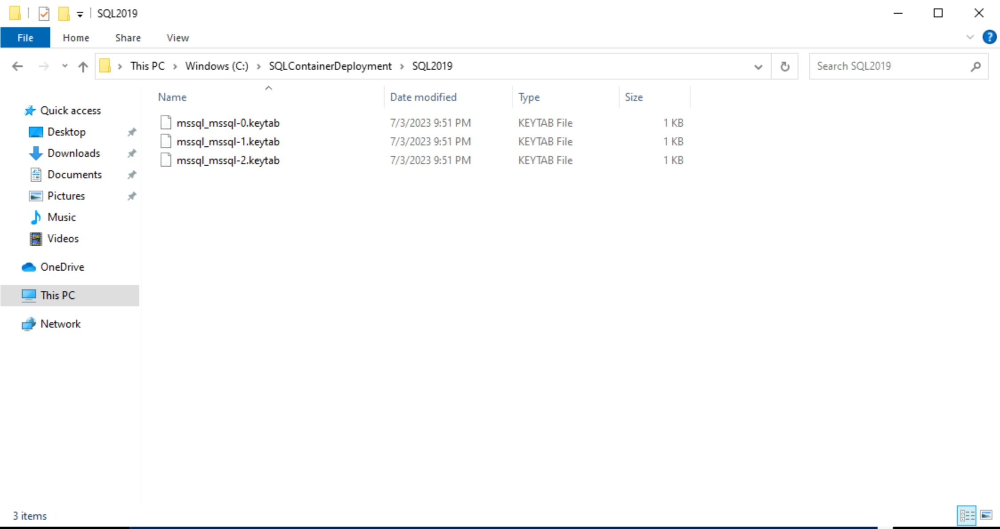

[Continue >](../modules/sql.md)
