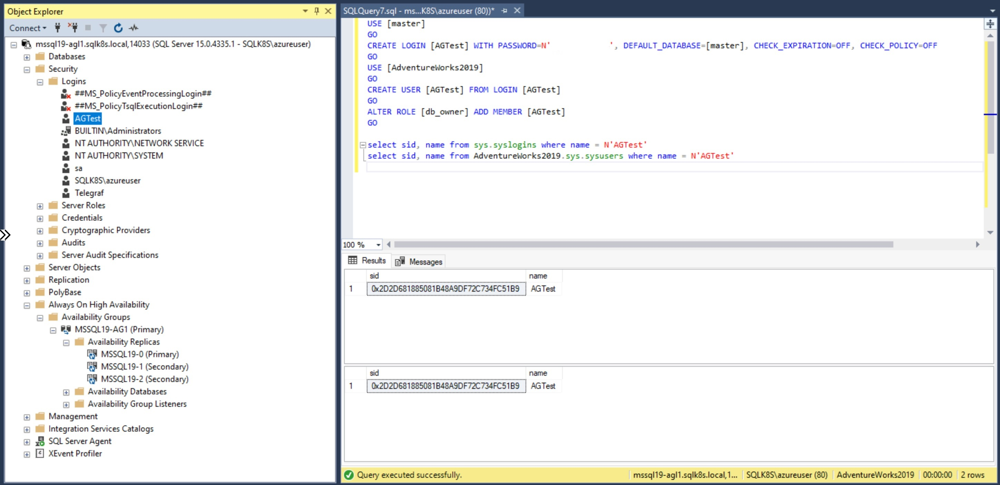
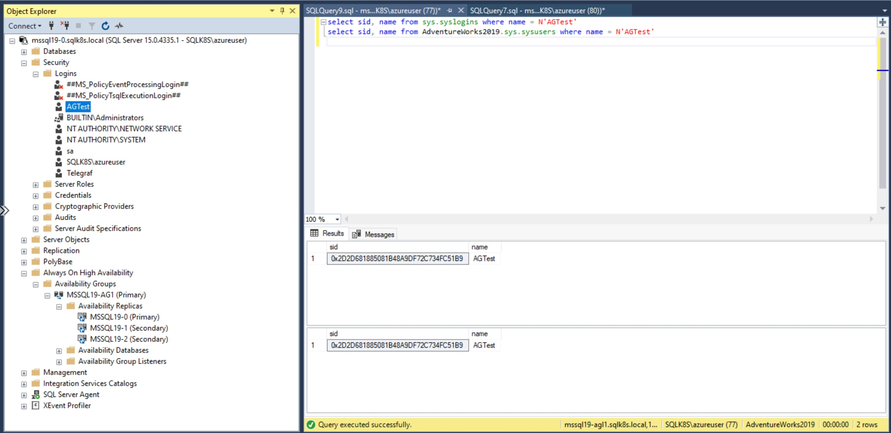
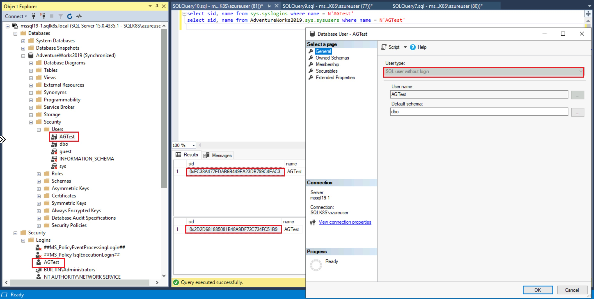
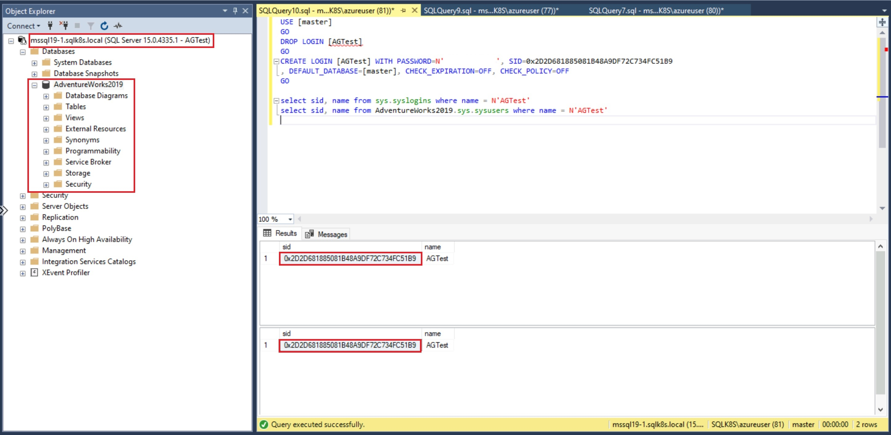
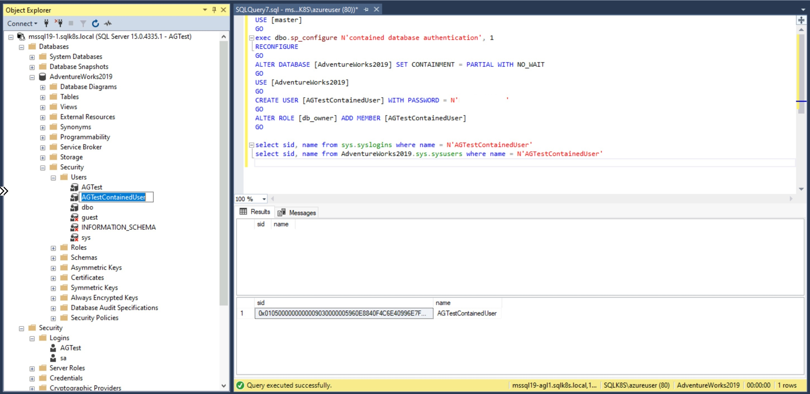
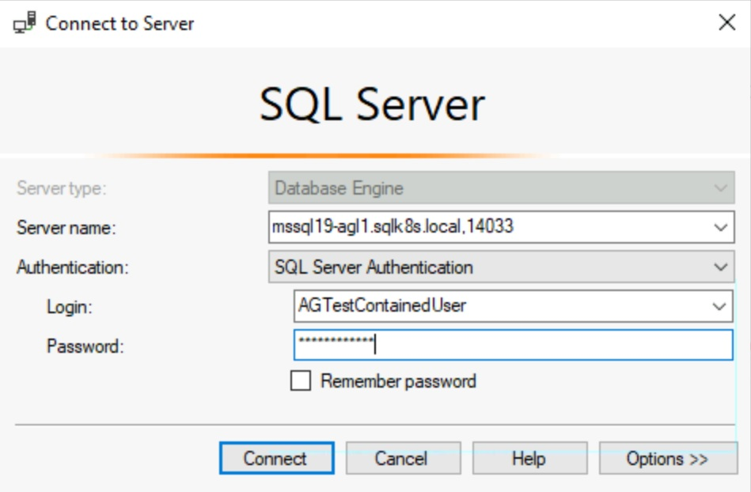
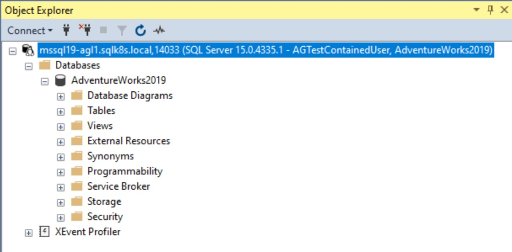
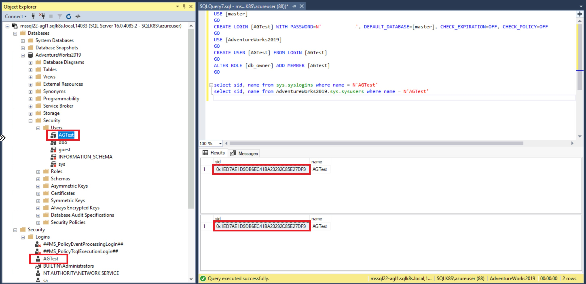

# How to configure logins and users on SQL Server Availability Groups

[< Previous Module](../modules/monitor.md) - **[Home](../README.md)**

## The problem

When you have installed and configured your SQL Server Instance(s), the next job is usually to create logins and database users for authentication and authorization.  This is generally a simple process when working with standalone servers but can become more complex when working with Availability Groups.  Especially when Windows logins can't be used and you have to resort to SQL logins.

The first problem is when you create the login and database user while connected to the listener.  The login will be created on the Primary Instance only, but the database user will be created in the replicated database.

  

  

The login is not created on the remaining replicas, so should a failover occur, the database user would still be available but the login would not exist.

  

  

**NB: The secondary replicas are readable to allow the query to return**

To resolve you need to create the login on each SQL Server Instance so that it maps to the database user.

  

However, with SQL Logins the SID is generated on each SQL Server Instance as the login is created.  If logins are created in the same order on each node then this shouldn't be a problem.  Otherwise the SIDs on each instance will differ, and not all match with the SID of the database user.  When this happens the database user doesn't map to the login on all nodes, causing login failures on the nodes where the user becomes orphaned.

  

  

## The solution for Availability Groups

One fix is to drop and re-create the login on the secondary replicas, providing the correct SID for the login.

  

Another fix is to enable contained users on your databases, that don't require a login to map to.  Contained database users allow you to authenticate directly to the database without needing to login to the SQL Server Instance.  Database users replicate to each replica because they are stored in the database and not the instance (master database).  The same applies to contained database users.  When you login, you must explicity change the default database to the database you want to login to.

  

  

  

  

## The solution for Contained Availability Groups

Contained Availability Groups offer a different solution.  They contain their own version of master and msdb system databases for use when connected via the Listener.  When you create a login while connected to the listener, the login is created in the synchronized copy of the master database, and not the master database itself.  This means the login and database users are replicated together.  As long as you create them while connected via the listener, they will continue to work after failover.

  

  

This solution makes Contained Availability Groups so much easier to use.  Logins, Credentials, Linked Servers, SQL Audits, and SQL Agent Jobs can all follow the user databases by creating them once while connected to the Listener.
