# Configure Monitoring

[< Previous Module](../modules/hadr22.md) - **[Home](../README.md)**

## Install and configure InfluxDB and Telegraf Agent

For this solution, you will be using InfluxDB to store the metric data, Telegraf Agent to collect the data, and Grafana to visualise the metrics.

1. Connect to SqlK8sJumpbox via Bastion (using domain account i.e. \<azureUser\>.sqlk8s.local)

    

2. Open Powershell

    

3. Login to Azure AD with an account that has ownership permissions to your subscription

    ```text
    az login
    ```

    

    

    

4. Create sqlmonitor namespace

    ```text
    kubectl create namespace sqlmonitor
    ```

    

5. Configure storage for InfluxDB

    ```text
    kubectl apply -f "C:\SQLServerk8s-main\yaml\SQLContainerDeployment\Monitor\InfluxDB\storage.yaml" --namespace sqlmonitor
    ```

    

6. Deploy InfluxDB

    ```text
    kubectl apply -f "C:\SQLServerk8s-main\yaml\SQLContainerDeployment\Monitor\InfluxDB\deployment.yaml" --namespace sqlmonitor
    ```

    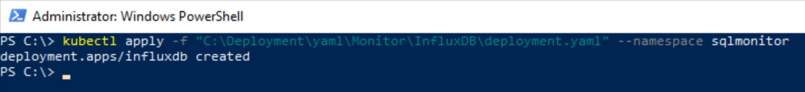

7. Expose internal IP Address and Port for InfluxDB

    ```text
    kubectl expose deployment influxdb --port=8086 --target-port=8086 --protocol=TCP --type=ClusterIP --namespace sqlmonitor
    ```

    

8. Create internal load balancer for InfluxDB

    ```text
    kubectl apply -f "C:\SQLServerk8s-main\yaml\SQLContainerDeployment\Monitor\InfluxDB\service.yaml" --namespace sqlmonitor
    ```

    

9. Verify pod and services are running

    ```text
    kubectl get pods -n sqlmonitor
    ```

    ```text
    kubectl get services -n sqlmonitor
    ```

    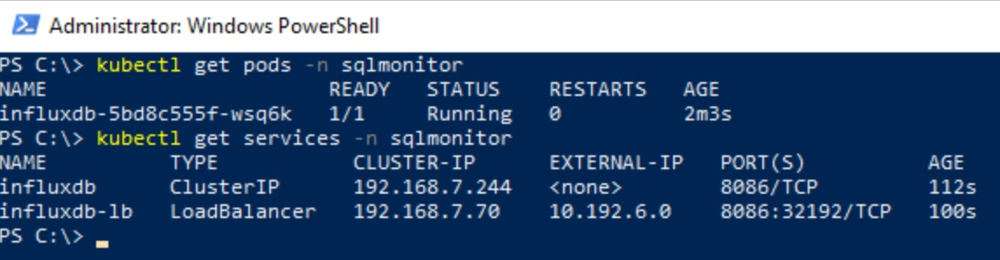

10. Connect to InfluxDB via Edge (http://influxdb.sqlk8s.local:8086) and click **Get Started**

    

11. Enter the following and click **Continue**

* User = root
* Password = root1234
* Initial Organization Name = sqlmon
* Initial Bucket Name = sqlmon

    

12. Click the **Advanced** button on the Complete page

    

13. On the Load Data page, click the **Add Data** button in the sqlmon panel, then click **Configure Telegraf Agent**

    

14. Ensure the bucket says **sqlmon** and then filter for, and choose the **SQL Server** data source. Click **Continue Configuring**

    

15. Make the following configuration changes

* Configuration Name = sqlmon
    
    Replace line 11 within the servers section and edit the ip address and password

    **NB: To get the ip address info for the sql pods run \"kubectl get services -n sql19\" or \"kubectl get services -n sql22\"**

    

    For SQL Server 2019

    ```text
        "Server=<mssql19-0-lb ClusterIP>;Port=1433;User Id=Telegraf;Password=<azurePassword>;app name=telegraf;log=1;",
        "Server=<mssql19-1-lb ClusterIP>;Port=1433;User Id=Telegraf;Password=<azurePassword>;app name=telegraf;log=1;",
        "Server=<mssql19-2-lb ClusterIP>;Port=1433;User Id=Telegraf;Password=<azurePassword>;app name=telegraf;log=1;",
    ```

    For SQL Server 2022

    ```text
        "Server=<mssql22-0-lb ClusterIP>;Port=1433;User Id=Telegraf;Password=<azurePassword>;app name=telegraf;log=1;",
        "Server=<mssql22-1-lb ClusterIP>;Port=1433;User Id=Telegraf;Password=<azurePassword>;app name=telegraf;log=1;",
        "Server=<mssql22-2-lb ClusterIP>;Port=1433;User Id=Telegraf;Password=<azurePassword>;app name=telegraf;log=1;",
    ```

    Copy the server entries (lines 11-13) and then click **Save and Test**

    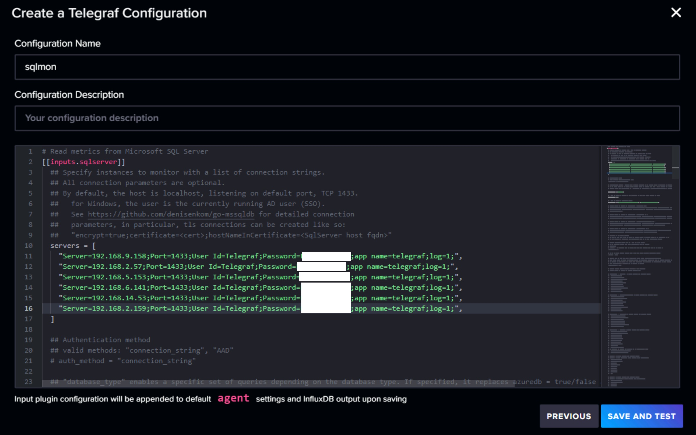

16. Edit **C:\SQLServerk8s-main\yaml\SQLContainerDeployment\Monitor\Telegraf\config.yaml** in notepad

    Replace lines 143-145 with the server configurations created in **Step 15**

    Edit line 89 and update the ip address in the URL with \<influxdb ClusterIP\>

    **NB: To get the ip address info for the influxdb pod run \"kubectl get services -n sqlmonitor\"**

    

    Edit line 92 by adding the API Token (this is provided on the \"Test your Configuration\" page, copy everything after \"export INFLUX_TOKEN=\")

    

    Save and close the file

    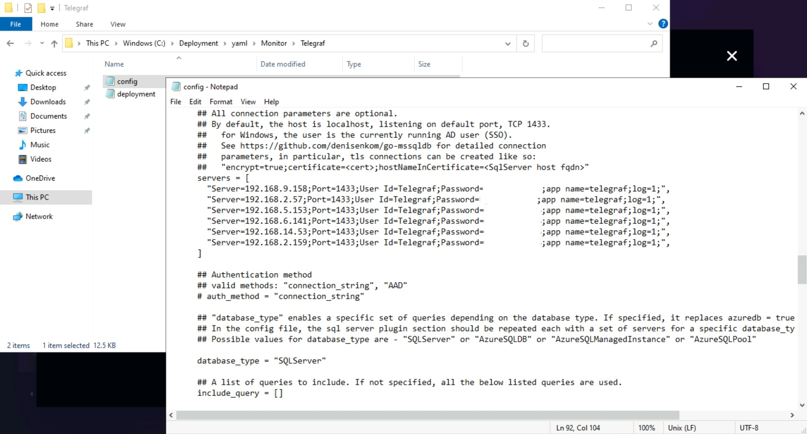

    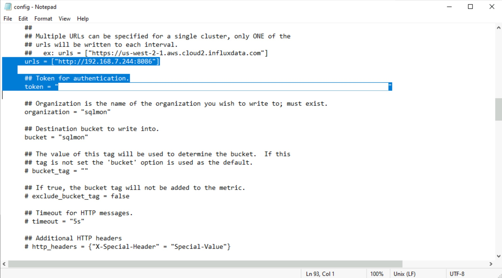

17. Go back to the \"Test your Configuration\" page and click **Finish**

    

18. Deploy the Telegraf configuration file

    ```text
        kubectl apply -f "C:\SQLServerk8s-main\yaml\SQLContainerDeployment\Monitor\Telegraf\config.yaml" --namespace sqlmonitor
    ```

    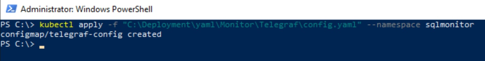

19. Deploy the Telegraf agent

    ```text
        kubectl apply -f "C:\SQLServerk8s-main\yaml\SQLContainerDeployment\Monitor\Telegraf\deployment.yaml" --namespace sqlmonitor
    ```

    

20. Explose the Telegraf agent service

    ```text
        kubectl expose deployment telegraf --port=8125 --target-port=8125 --protocol=UDP --type=NodePort --namespace sqlmonitor
    ```

    

21. Verify pod and service are running

    ```text
    kubectl get pods -n sqlmonitor
    ```

    ```text
    kubectl get services -n sqlmonitor
    ```

    

22. Go back to the InfluxDB web app and select **Buckets** and then **sqlmon**

    

23. Verify data is being collected by replacing the contents of the flux script with the script below and then click **Run**

    ```text
    from(bucket: "sqlmon")
    |> range(start: v.timeRangeStart, stop: v.timeRangeStop)
    |> filter(fn: (r) => r["_measurement"] == "sqlserver_performance")
    |> filter(fn: (r) => r["_field"] == "value")
    |> filter(fn: (r) => r["counter"] == "Page life expectancy")
    |> filter(fn: (r) => r["measurement_db_type"] == "SQLServer")
    |> filter(fn: (r) => r["object"] == "SQLServer:Buffer Node")
    |> aggregateWindow(every: v.windowPeriod, fn: mean, createEmpty: false)
    |> yield(name: "mean")
    ```

    If you see data for **_measurement** of **sqlserver_performance** underneath the script then everything is running correctly

    

24. Go to API Tokens from the left menu blade and click **Generate API Token** followed by **Custom API Token**

    

    

25. Click **Buckets** to expand the selection, then tick the **Read** box for **sqlmon** and click **Generate**

    

26. Copy the API Token to the clipboard and then paste into a notepad file to be used when configuring Grafana

    **NB: The Copy to Clipboard may not work.  If it doesn't then highlight the token and copy manually.**

    

## Install and configure Grafana

This solution currently creates Grafana as a pod on your AKS cluster but you could also set this up on central server

**NB: At the moment this solution is not highly available.  The pod will be re-created if deleted but will require re-configuring.**

1. Create the credentials for Grafana as a secret

    ```text
    kubectl create secret generic grafana-creds --from-literal=GF_SECURITY_ADMIN_USER=admin --from-literal=GF_SECURITY_ADMIN_PASSWORD=admin1234 --namespace sqlmonitor
    ```

    

2. Deploy Grafana
    ```text
    kubectl apply -f "C:\SQLServerk8s-main\yaml\SQLContainerDeployment\Monitor\Grafana\deployment.yaml" --namespace sqlmonitor
    ```

    

3. Deploy Internal Load Balancer for Grafana
    ```text
    kubectl apply -f "C:\SQLServerk8s-main\yaml\SQLContainerDeployment\Monitor\Grafana\service.yaml" --namespace sqlmonitor
    ```

    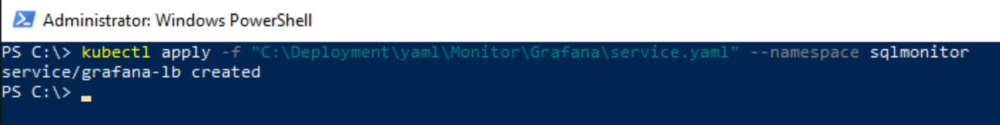

4. Verify pod and service are running

    ```text
    kubectl get pods -n sqlmonitor
    ```

    ```text
    kubectl get services -n sqlmonitor
    ```

    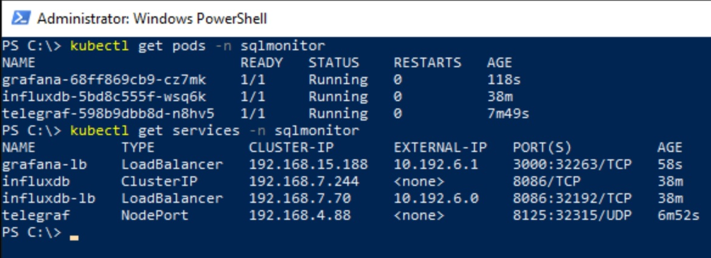

5. Connect to Grafana via Edge (http://grafana.sqlk8s.local:3000)

    

6. Login by using the credentials below and clicking **Log in**

* User = admin
* Password = admin1234

    

7. On the \"Welcome to Grafana\" page click on the **Data Sources** panel where it says \"Add your first data source\"

    

8. Select **InfluxDB** from the list of sources

    

9. Edit the data source and click **Save and test**

* Name = InfluxDB
* Query Language = Flux
* HTTP URL = http://\<influxdb ClusterIP\>:8086
* Auth Basic Auth = Disabled
* InfluxDB Details Organization = sqlmon
* InfluxDB Details Token = \<API Token with read permissions to sqlmon\>
* InfluxDB Details Default Bucket = sqlmon

    **NB: You should get a message saying \"datasource is working. 1 buckets found\"**

    

    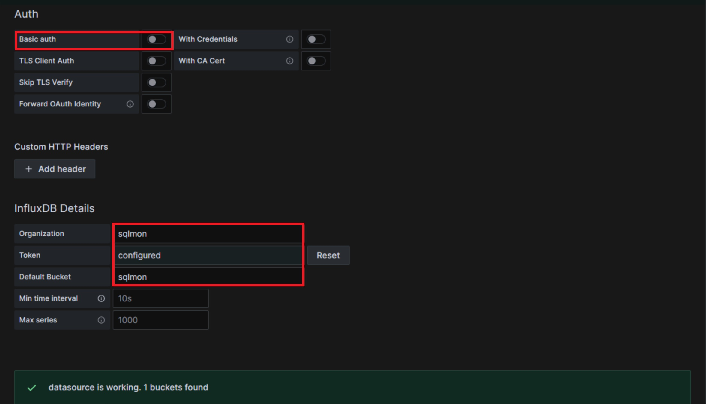

10. From the left menu blade select **Dashboards**

    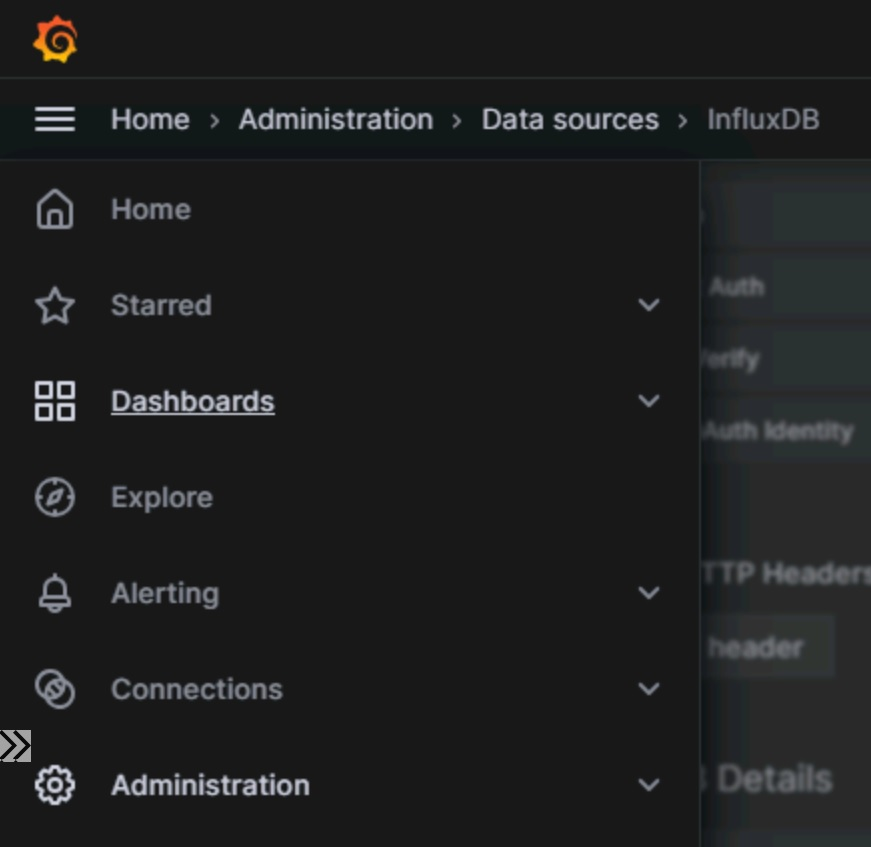

11. Click **New** followed by **New Dashboard**

    

12. Underneath \"Start your new dashboard by adding a visualization\" click **Add visualization**

    

13. From the \"Select data source\" popup select **InfluxDB**

    

14. Click **Apply** on the panel editor to take you to the empty dashboard and then click the dashboard settings button from the top tool bar

    

    

15. Go to **JSON model** from the left settings blade and around line 25 you should find configurations for the influxdb data source.  Copy the uid and paste in notepad

    

16. Click **Close** at the top of screen and then go back to **Dashboards** from the left menu blade or breadcrumb

    **NB: You will be prompted to save or discard changes to your new dashboard.  Click Discard.**

    

17. Click **New** followed by **Import**

    

18. Drag and drop **C:\SQLServerk8s-main\yaml\SQLContainerDeployment\Monitor\Grafana\Dashboard.json** into the upload panel and then click **Import**

    **NB: When the dashboard loads it will contain failure messages and none of the charts will display.  This is as expected.**

    

    

19. Click the **dashboard settings** button from the top menu bar and select **Variables** from the settings blade

    

    

20. Click on the **datasource** variable and populate the **Custom options - Values separated by comma** with the uid of the datasource, then click **Save dashboard** followed by **Save**

    

    

21. Click **Close** to go back to the dashboard

    

22. Click the **Refresh dashboard** button and the dashboard should start working

    

    

23. Change between each of the hosts and view the charts for each

    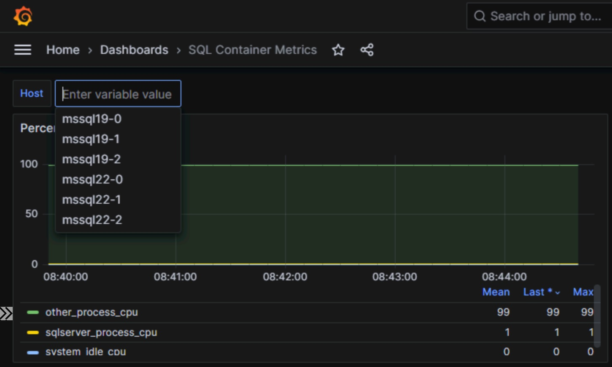

24. Try Running some problematic queries against the primary and monitor the performance

25. Try failing over and verifying performance on each pod
