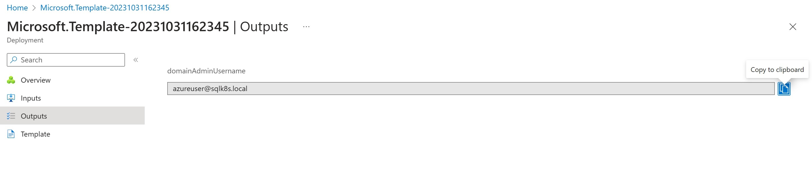
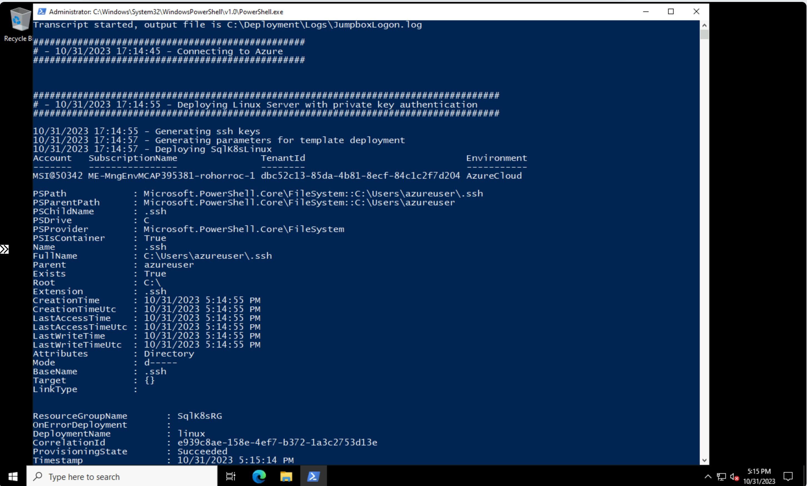

# Lab Setup with AKS Cluster using privatelink connections

**[Home](../README.md)** - [Next Module >](../modules/sql19.md)

## Prerequisites

* An [Azure account](https://azure.microsoft.com/free/) with owner permissions on an active subscription.

## Deployment

The following options are available

1. Deploy lab environment including domain, kerberos authentication, and TLS certificates. You can then follow instructions on how to install a standalone instance of SQL Server 2019 and \/ or SQL Server 2022.
    1. Select **NO** for the **Install SQL 2019** and **Install SQL 2022** parameters
    2. Leave the **DH2i License Key** parameter blank
2. Deploy lab environment including domain, kerberos authenticion, and TLS certificates.  You can then follow instructions on how to install an Availability Group on SQL Server 2019 and \/ or a Contained Availability Group on SQL Server 2022 using DH2i\'s DxEnterprise Clustering solution (each contains 3 replicas).
    1. Select **NO** for the **Install SQL 2019** and **Install SQL 2022** parameters
    2. Add your **DH2i License Key**
3. Deploy a standalone SQL Server 2019 and \/ or SQL Server 2022 instance on an AKS Cluster.
    1. Select **Yes** for the **Install SQL 2019** and \/ or **Install SQL 2022** parameters
    2. Leave the **DH2i License Key** parameter blank
4. Deploy an Availability Group on SQL Server 2019 and \/ or a Contained Availability Group on SQL Server 2022 using DH2i\'s DxEnterprise Clustering solution (each contains 3 replicas).
    1. Select **Yes** for the **Install SQL 2019** and \/ or **Install SQL 2022** parameters
    2. Add your **DH2i License Key**

**NB: For the Always-on Availability Group solutions, you will be using DxEnterprise which is a licensed product from DH2i.  For more information refer to https://support.dh2i.com/docs/guides/dxenterprise/containers/kubernetes/mssql-ag-k8s-statefulset-qsg/.  The first thing you will need to do is obtain a license to use the DxEnterprise software.  For the purpose of testing / proof of concepts you can register and download a development license from https://dh2i.com/trial/.**

The following resources will be deployed (takes around 30-40 minutes to deploy resources followed by another 5-20 minute to exeucte the Jumpbox (SqlK8sJumpbox) logon script).

* Virtual Network (SqlK8s-vnet)
* 3 subnets (AKS, VMs, AzureBastionSubnet)
* Bastion Host (SqlK8s-bastion)
* 3 Virtual Machines (Standard D2s v3)
    * SqlK8sDC (Domain Controller with 1 Nic and 1 OS Disk)
    * SqlK8sLinux (Linux server used to join AKS containers to domain with 1 Nic and 1 OS Disk)
    * SqlK8sJumpbox (Client used to run scripts with 1 Nic and 1 OS Disk)
* 4 Network Security Groups (1 for each subnet and 1 for Nic on SqlK8sJumpbox)
* 2 Public IP Addresses (1 for Bastion and 1 for Jumpbox)
* Azure Kubernetes Cluster (VM Scale Set with 2 - 4 Standard_D8s_v3 VMs)

**NB: This deployment can be expensive to keep running but you can reduce costs by shutting down the 3 Virtual Machines and AKS Cluster, and starting up when required.  You can also drop the bastion host when shutting down the Virtual Machines and then re-create when required.**

**The Linux server (SqlK8sLinux) is not required once deployment has completed.  It can be permanently deleted.**

## Deploy Azure Resources

1. Right-click or **Ctrl + click** the deploy button under [Deployment](#deployment).  This will open the Azure Portal in a new window.

2. Complete the form and then click **Review + create**

    * Subscription - Your Subscription
    * Resource group - New or existing Resource Group
    * Region - Region where you want all resources to be deployed
    * Admin Username - This will become the domain admin of the **SqlK8s** domain
    * Admin Password - This will become the password for your domain admin username and for the SQL Server sa account
    * Github Branch - This should be left as **main** which will use the main branch from the Github repository
    * Ip Address Range_10.X.0.0 - A number between 0 and 255 to set the IP Address range of your network (default is 0 for 10.0.0.0, max is 255 for 10.255.0.0)
    * Install SQL2019 - Select **Yes** if you want SQL Server 2019 to be automatically installed
    * Install SQL2022 - Select **Yes** if you want SQL Server 2022 to be automatically installed
    * DH2i License Key - Leave blank to install standalone instances or populate to automatically configure an Availability Group (SQL Server 2019) and \/ or a Contained Availability Group (SQL Server 2022)

    

3. Click **Create**

    

4. Go to **Outputs** and copy the **domainAdminUsername**

    

5. Go to your new Resource group

    

6. Find and select your SqlK8sJumpbox Virtual Machine

    

7. Connect to SqlK8sJumpbox using Bastion

    

8. Enter the credentials you supplied on the Azure resource deployment template (the user was copied in **Step 4**)

    

9. A Powershell window will open and setup the lab (usually takes between 5-20 minutes).  Once the script has completed, your lab environment should be ready.

    

10. Should an error occur during the setup process you should be able to refer to the logs in **C:\Deployment\Logs**.  Collect the logs and raise a bug in the Github project.

If you have opted to automatically setup your SQL Server instances then go to the page on "[How to configure logins and users on SQL Server Availability Groups](../modules/logins.md)".  Otherwise hit **Continue** at the bottom of the page to move to the SQL Server 2019 installation tutorial or "[Create SQL Server 2022 Container Instances](./modules/sql22.md)" to install SQL Server 2022.

[Continue >](../modules/sql19.md)
