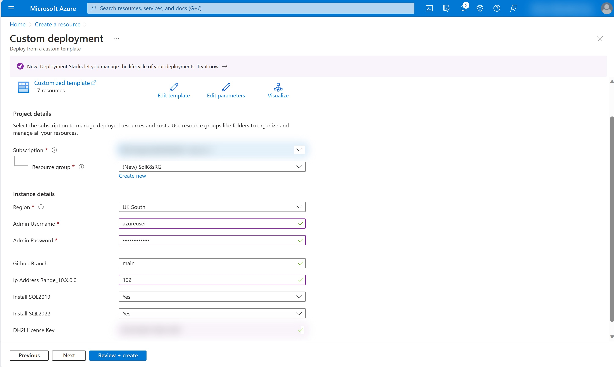
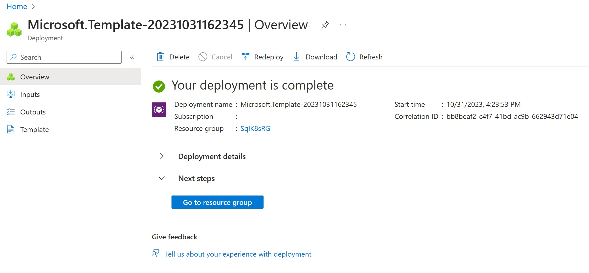
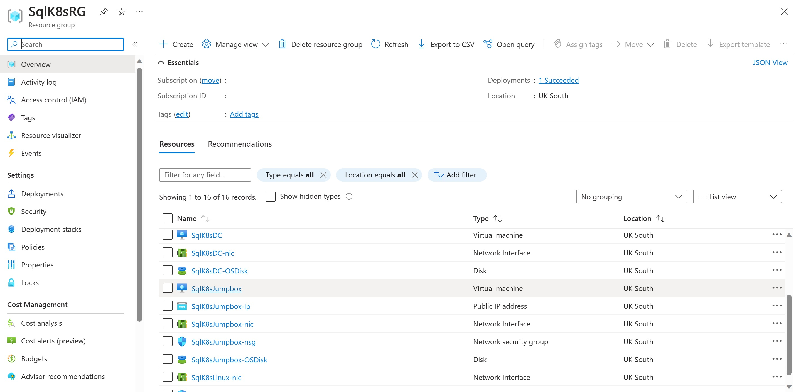
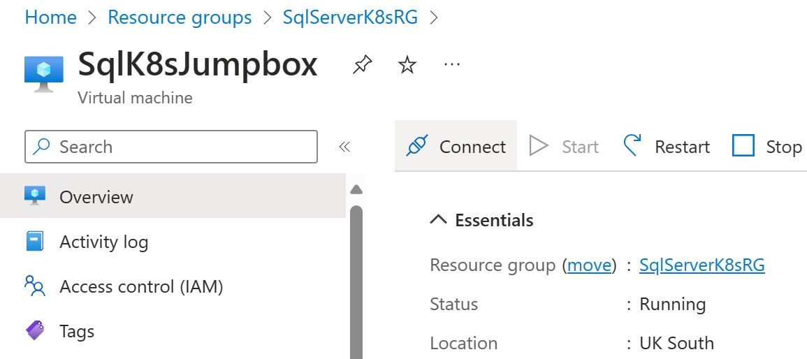
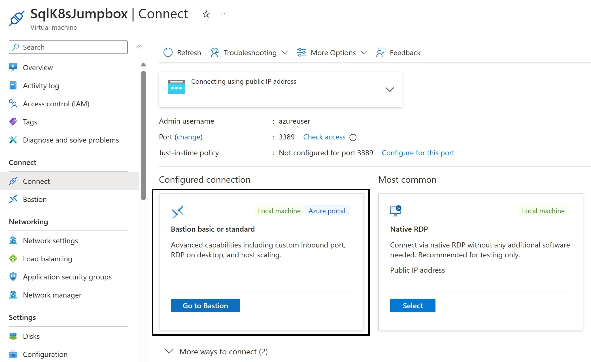
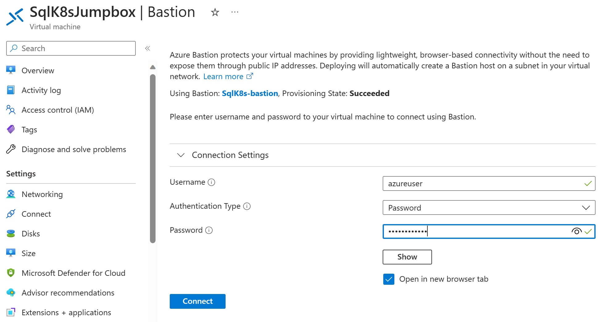
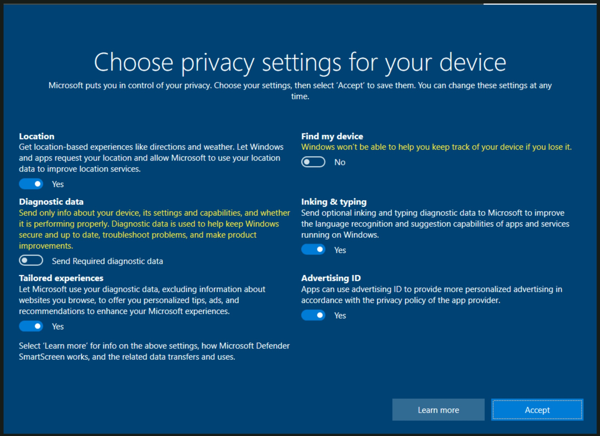
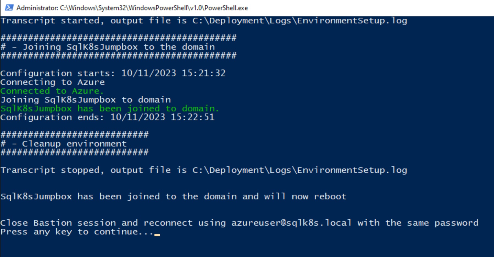
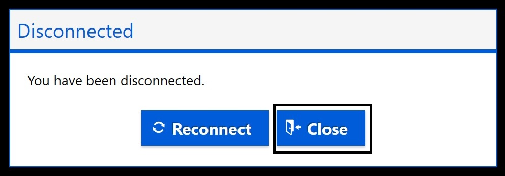

# Setup Environment with AKS Cluster using privatelink connections

**[Home](../README.md)** - [Next Module >](../modules/kerberos.md)

## Prerequisites

* An [Azure account](https://azure.microsoft.com/free/) with owner permissions on an active subscription.

## Deployment

The following resources will be deployed (expensive to keep running and takes around 40 minutes to deploy).

* Virtual Network (SqlK8s-vnet)
* 3 subnets (AKS, VMs, AzureBastionSubnet)
* Bastion Host (SqlK8s-bastion)
* 3 Virtual Machines (Standard D2s v3)
    * SqlK8sDC (Domain Controller with 1 Nic and 1 OS Disk)
    * SqlK8sLinux (Linux server used to join AKS containers to domain with 1 Nic and 1 OS Disk)
    * SqlK8sJumpbox (Client used to run scripts with 1 Nic and 1 OS Disk)
* 4 Network Security Groups (1 for each subnet and 1 for Nic on SqlK8sJumpbox)
* 2 Public IP Addresses (1 for Bastion and 1 for Jumpbox)
* Azure Kubernetes Cluster (VM Scale Set with 2 - 3 Standard_D8s_v3 VMs)

**NB: The Scale set has a minimum of 2 VMs to handle either of the SQL Server 2019 or 2022 deployments.  But it can scale to a maximum of 3 VMs if you wish to deploy both.** 

## Deploy Azure Resources

1. Right-click or **Ctrl + click** the deploy button under [Deployment](#deployment).  This will open the Azure Portal in a new window.

2. Complete the form and then click **Review + create**

    * Subscription - Your Subscription
    * Resource group - New or existing Resource Group
    * Region - Region where you want all resources to be deployed
    * Admin Username - Username that will initially be local admin of your jumpbox but will then be promoted to domain admin
    * Admin Password - Password for Admin Username
    * Github Branch - This should be left as **main** which will use the main branch from the Github repository
    * Ip Address Range_10.X.0.0 - A number between 0 and 255 to set the IP Address range of your network (default is 0 for 10.0.0.0, max is 255 for 10.255.0.0)

    

3. Click **Create**

    

4. Go to your new Resource group

    

5. Find and select your SqlK8sJumpbox Virtual Machine

    

6. Connect to SqlK8sJumpbox using Bastion

    

7. Enter the credentials you supplied on the Azure resource deployment template

    

8. Accept the privacy settings

    

9. Click on the desktop away from the Networks message

    

10. A Powershell window will open and begin joining the jumpbox to the domain.  Once the script has completed it will prompt you to press a key to reboot and then logon using the new domain credentials with the same password.  Follow these instructions to complete the setup process.

    

    

    

11. Should an error occur during the domain setup process you should be able to refer to the logs in **C:\Deployment\Logs**.  Collect the logs and raise a bug in the Github project.

[Continue >](../modules/kerberos.md)
