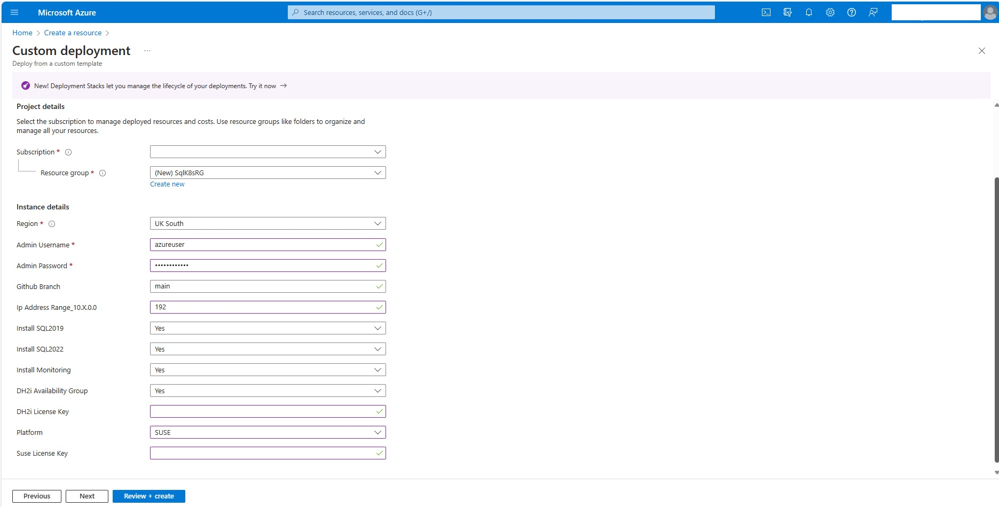
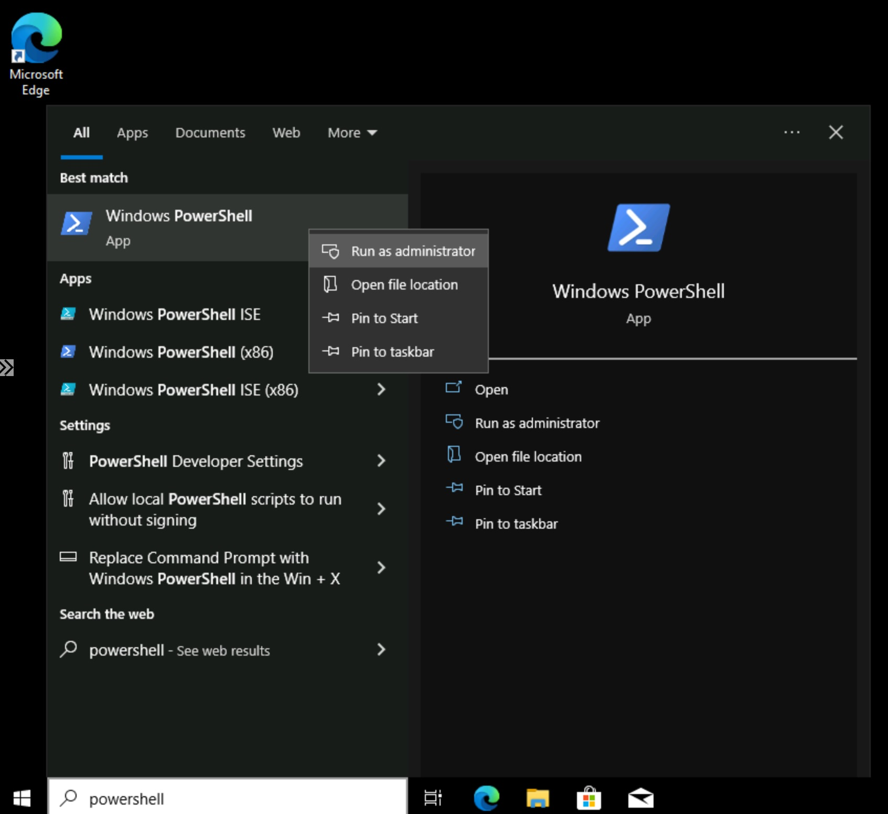

# Setup Environment with AKS Cluster using privatelink connections

**[Home](../README.md)** - [Next Module >](../modules/kerberos.md)

## Prerequisites

* An [Azure account](https://azure.microsoft.com/free/) with owner permissions of an active subscription.
* Permissions to create Azure AD Service Principals.

## Azure Resources

The following resources will be deployed (expensive to keep running)

### Deployment

* Virtual Network (SqlK8s-vnet)
* 3 subnets (AKS, VMs, AzureBastionSubnet)
* Bastion Host (SqlK8s-bastion)
* 3 Virtual Machines (Standard D2s v3)
    * SqlK8sDC (Domain Controller with 1 Nic and 1 OS Disk)
    * SqlK8sLinux (Linux server used to join AKS containers to domain with 1 Nic and 1 OS Disk)
    * SqlK8sJumpbox (Client used to run scripts with 1 Nic and 1 OS Disk)
* 4 Network Security Groups (1 for each subnet and 1 for Nic on SqlK8sJumpbox)
* 2 Public IP Addresses (1 for Bastion and 1 for Jumpbox)
* Azure Kubernetes Cluster (VM Scale Set with 2 - 3 Standard_D8s_v3 VMs)

    **NB: The Scale set has a minimum of 2 VMs to handle either of the SQL Server 2019 or 2022 deployments.  But it can scale to a maximum of 3 VMs if you wish to deploy both.** 

## Create Service Principal

1. Right-click or `Ctrl + click` the button below to open the Azure Portal in a new window.


## Deploy Azure Resources

1. Right-click or `Ctrl + click` the button below to open the Azure Portal in a new window.

    [](https://portal.azure.com/#create/Microsoft.Template/uri/https%3A%2F%2Fraw.githubusercontent.com%2FBobbyH49%2FSQLServerk8s%2Fmain%2Ftemplates%2Fsetup.json)

2. Complete the form and then click **Review + create**

    

3. Click **Create**

4. Your resources will take around 10 minutes to create with the longest resource being the bastion (SqlK8s-bastion)

    

## Install dependencies

1. Go to your new Resource group

    

2. Find and select your SqlK8sJumpbox Virtual Machine

    

3. Connect to SqlK8sJumpbox using Bastion and credentials supplied during deployment

    

4. Enter the credentials you supplied on the Azure resource deployment template

    

5. Accept the privacy settings

    

6. Click on the desktop away from the Networks message

    

7. Open Powershell as Administrator

    

8. Install NuGet

    ```text
    Install-PackageProvider -Name NuGet -Force
    ```

    

9. Install Azure Powershell module (Az)

    ```text
    Install-Module Az -AllowClobber -Force
    ```

    

10. Install Azure CLI

    For the latest version go to https://docs.microsoft.com/en-us/cli/azure/install-azure-cli-windows?tabs=azure-cli

    ```text
    $ProgressPreference = 'SilentlyContinue'; Invoke-WebRequest -Uri https://aka.ms/installazurecliwindows -OutFile .\AzureCLI.msi; Start-Process msiexec.exe -Wait -ArgumentList '/I AzureCLI.msi /quiet'; rm .\AzureCLI.msi
    ```

    

    **Restart Powershell**

    

    

11. Install Kubectl
    
    For latest version go to https://kubernetes.io/docs/tasks/tools/install-kubectl-windows/
    Example download using curl for version 1.24.0 

    ```text
    $ProgressPreference = 'SilentlyContinue'; mkdir C:\Kube; Invoke-WebRequest -Uri https://dl.k8s.io/release/v1.24.0/bin/windows/amd64/kubectl.exe -OutFile "C:\kube\kubectl.exe"
    ```

    

    Validate by running the following and comparing the two versions in SHA256 format

    ```text
    $ProgressPreference = 'SilentlyContinue'; Invoke-WebRequest -Uri https://dl.k8s.io/v1.24.0/bin/windows/amd64/kubectl.exe.sha256 -OutFile "C:\kube\kubectl.exe.sha256"
    CertUtil -hashfile C:\kube\kubectl.exe SHA256
    type C:\kube\kubectl.exe.sha256
    ```

    

    Update **Path** environmental variable

    ```text
    $env:Path += "C:\kube;"
    [Environment]::SetEnvironmentVariable("Path", $env:Path, [System.EnvironmentVariableTarget]::Machine)
    ```

    

    **Restart Powershell**

    

    

    Ensure you are able to run Kubectl in **Powershell**

    ```text
    kubectl version --client
    ```

    

12. Download and install [Putty 64-bit x86](https://putty.org/) on SqlK8sJumpbox with all default settings

    

    

    

13. Download and install [SQL Server Management Studio](https://learn.microsoft.com/en-us/sql/ssms/download-sql-server-management-studio-ssms?view=sql-server-ver16) on SqlK8sJumpbox with all default settings

    

    

14. Download and extract the contents of the [SQLServerk8s](https://github.com/BobbyH49/SQLServerk8s/archive/refs/heads/main.zip) project to the root of the C Drive

    

    

    

15. Download the AdventureWorks2019 database backup from https://github.com/Microsoft/sql-server-samples/releases/download/adventureworks/AdventureWorks2019.bak and copy to C:\SQLBackups\AdventureWorks2019.bak

    

    

## Create Domain Controller

This script will install Active Directory Directory Services (ADDS) on SqlK8sDC and then promote it to a Domain Controller.  It will then create an OU called ComputersOU and make this the default OU for domain joined computers.

1. Open Powershell ISE as Administrator on SqlK8sJumpbox

    

2. Open the script "C:\SQLServerk8s-main\scripts\ConfigureDC.ps1"

    

3. Run the script with the following parameters (if you get a popup security warning message then select **Run once**)

    1. subscriptionId - Go to your deployed Resource Group to get the Subscription Id
    2. resourceGroup - The name of your new Resource Group
    3. location - The region used to deploy your resources (e.g. uksouth)
    4. azureUser & azurePassword - The credentials supplied during the azure deployment (for consistency)

    

    

4. You will be prompted to sign in using an Azure AD account (use one with owner permissions to the subscription) and the script should take around 15-20 minutes to execute

    **NB: The DNS server configured for the Virtual Network (SqlK8s-vnet) is 10.192.4.4 (SqlK8sDC).  However, the DNS server configured for the jumpbox (SqlK8sJumpbox) has been overridden to 168.63.129.16 (Azure DNS).  This was done to allow the dependencies to be downloaded using name resolution of public servers.  This script removes the override to allow the Jumpbox to join to the domain.**

    

5. Reboot SqlK8sJumpbox and re-open Powershell as Administrator

    

    

    

6. Verify that you can ping the SqlK8s.local domain

    ```text
    ping sqlk8s.local
    ```

    

## Join Jumpbox to the Domain

This script will join SqlK8sJumpbox to the SqlK8s.local domain.

1. Open Powershell ISE as Administrator on SqlK8sJumpbox

    

2. Open the script "C:\SQLServerk8s-main\scripts\DCJoinJumpbox.ps1"

    

3. Run the script with the following parameters (if you get a popup security warning message then select **Run once**)

    1. subscriptionId - Go to your deployed Resource Group to get the Subscription Id
    2. resourceGroup - The name of your new Resource Group
    3. azureUser & azurePassword - The credentials supplied during the azure deployment

    

    

    **NB: SqlK8sJumpbox will reboot during the running of this script.  Close the session rather than re-connecting and then log in from the Bastion using \<azureUser\>@sqlk8s.local where \<azureUser\> is the username that you have provisioned.**

    

## Deploy AKS Cluster

1. Connect to SqlK8sDC using Bastion and credentials supplied during deployment with username in the format \<azureUser\>@sqlk8s.local

    

2. Open Powershell as Administrator

    

3. Create DNS Conditional Forwarder for privatelink connection to the AKS Cluster with \<location\> as the region for the previous deployment (e.g. uksouth)

    ```text
    Add-DnsServerConditionalForwarderZone -Name privatelink.<location>.azmk8s.io -MasterServers 168.63.129.16
    ```

    

4. Right-click or `Ctrl + click` the button below to open the Azure Portal in a new window

    **NB: You should run this locally or from SqlK8sJumpbox (not SqlK8sDC)**

    [](https://portal.azure.com/#create/Microsoft.Template/uri/https%3A%2F%2Fraw.githubusercontent.com%2FBobbyH49%2FSQLServerk8s%2Fmain%2Ftemplates%2Faks.json)

5. Complete the form using the same resource group and location as before

    

6. Click **Review + create**

7. Click **Create**

    

8. Connect to SqlK8sJumpbox using Bastion and credentials supplied during deployment with username in the format \<azureUser\>@sqlk8s.local

    

9. Open Powershell as Administrator

    

10. Configure your AKS Principal with permissions to the AKS subnet (providing your subscriptionId and resourceGroup)

    ```text
    param(
        [Parameter(Mandatory = $true)]
        [string]$subscriptionId,
        [Parameter(Mandatory = $true)]
        [string]$resourceGroup
    )
    Connect-AzAccount
    Set-AzContext -Subscription $subscriptionId
    az login
    az account set --subscription $subscriptionId
    $objectid = (Get-AzADServicePrincipal -DisplayName "sqlk8saks").id
    az role assignment create --assignee $objectid --role "Network Contributor" --scope "/subscriptions/$subscriptionId/resourceGroups/$resourceGroup/providers/Microsoft.Network/virtualNetworks/sqlk8s-vnet/subnets/AKS"
    ```

    **NB: You will need to sign in to Azure twice. The previous sign in was was via Azure Powershell under your local account session whereas these two sign ins are for Azure Powershell and Azure CLI under your domain account session. Azure Powershell will produce a popup but Azure CLI will open via Edge**

    

    

    

    

    

[Continue >](../modules/kerberos.md)
