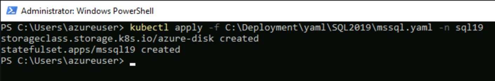
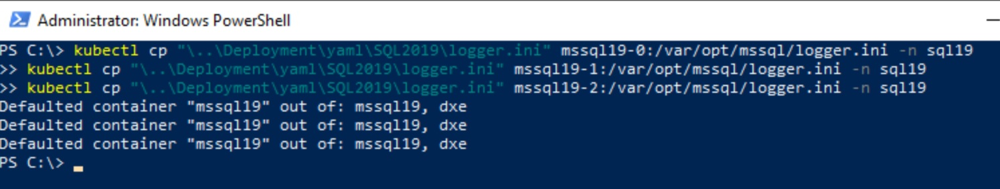

# Create SQL Server 2019 Container Instances

[< Previous Module](../modules/kerberos.md) - **[Home](../README.md)** - [Next Module >](../modules/hadr19.md)

## Install and configure SQL Server 2019 on Containers

**NB: This page is all about installing and configuring the SQL Server Container Instances.  However, there are some prerequisites for the clustering technology which will also be configured.**

**DH2I is the clustering technology of choice.  For more information refer to https://support.dh2i.com/docs/guides/dxenterprise/containers/kubernetes/mssql-ag-k8s-statefulset-qsg/.**

1. Connect to SqlK8sJumpbox via Bastion (using domain account i.e. \<adminUsername\>@sqlk8s.local)

    

2. Edit the following yaml files and replace all occurrences of <IP Address Value> with the parameter you supplied in the ARM template deployment.

    * C:\Deployment\yaml\SQL2019\dxemssql.yaml
    * C:\Deployment\yaml\SQL2019\pod-service.yaml
    * C:\Deployment\yaml\SQL2019\service.yaml

    

3. Open Powershell

    

4. Login to Azure AD with an account that has ownership permissions to your subscription

    ```text
    az login
    ```

    **NB: Edge may initially open up with a welcome page.  If so, then start without doing a data sync.**

    

    

    

    

5.	Configure your account to be in the scope of your subscription (get the \<subscriptionId\> from your Resource Group page)

    ```text
    az account set --subscription <subscriptionId>
    ```

    

6. Connect to your AKS Cluster in the scope of your \<resourceGroup\> and store the profile

    ```text
    az aks get-credentials -n sqlk8saks -g <resourceGroup>
    ```

    

7. Create SQL Namespace

    ```text
    kubectl create namespace sql19
    ```

    

8. Create headless services which will allow your SQL Server pods to connect to one another using hostnames

    ```text
    kubectl apply -f C:\Deployment\yaml\SQL2019\headless-services.yaml -n sql19
    ```

    

9. Create secret for SQL Server sa password using \<adminPassword\> for consistency

    ```text
    kubectl create secret generic mssql19 --from-literal=MSSQL_SA_PASSWORD=<adminPassword> -n sql19
    ```

    

10. Apply the Kerberos configuration file

    ```text
    kubectl apply -f C:\Deployment\yaml\SQL2019\krb5-conf.yaml -n sql19
    ```

    

11. Apply the SQL Server Configuration

    ```text
    kubectl apply -f C:\Deployment\yaml\SQL2019\mssql-conf.yaml -n sql19
    ```

    

12. Apply StatefulSet configuration of SQL Server and install cluster software (dxe)

    ```text
    kubectl apply -f C:\Deployment\yaml\SQL2019\dxemssql.yaml -n sql19
    ```

    

13. Add internal load balancers for each node

    ```text
    kubectl apply -f C:\Deployment\yaml\SQL2019\pod-service.yaml -n sql19
    ```

    

14. Verify pods and services are up and running

    ```text
    kubectl get pods -n sql19
    ```

    

    ```text
    kubectl get services -n sql19
    ```

    

15. Check pods by nodes (there will be 2 nodes if you are only running one instance e.g. SQL 2019 or SQL 2022, but this could increase up to 3 nodes if running both)

    ```text
    kubectl get pod -o=custom-columns=NAME:.metadata.name,STATUS:.status.phase,NODE:.spec.nodeName -n sql19
    ```

    

16. Copy the keytab files (created in the kerberos module) to all 3 SQL Pods

    **NB: This is only required if you have deployed the Domain Controller and completed all tasks from kerberos.md**

    ```text
    kubectl cp \..\Deployment\keytab\SQL2019\mssql_mssql19-0.keytab mssql19-0:/var/opt/mssql/secrets/mssql.keytab -n sql19
    kubectl cp \..\Deployment\keytab\SQL2019\mssql_mssql19-1.keytab mssql19-1:/var/opt/mssql/secrets/mssql.keytab -n sql19
    kubectl cp \..\Deployment\keytab\SQL2019\mssql_mssql19-2.keytab mssql19-2:/var/opt/mssql/secrets/mssql.keytab -n sql19
    ```

    

17. Copy logger.ini files to all 3 SQL Pods

    ```text
    kubectl cp "\..\Deployment\yaml\SQL2019\logger.ini" mssql19-0:/var/opt/mssql/logger.ini -n sql19
    kubectl cp "\..\Deployment\yaml\SQL2019\logger.ini" mssql19-1:/var/opt/mssql/logger.ini -n sql19
    kubectl cp "\..\Deployment\yaml\SQL2019\logger.ini" mssql19-2:/var/opt/mssql/logger.ini -n sql19
    ```

    

18. Copy SSL Certificate and Key files (created in the encryption module) to all 3 SQL Pods

    **NB: This is only required if you have deployed the Linux Server and completed all tasks from encryption.md**

    ```text
    kubectl cp "\..\Deployment\certificates\SQL2019\mssql19-0.pem" mssql19-0:/etc/ssl/certs/mssql.pem -n sql19
    kubectl cp "\..\Deployment\certificates\SQL2019\mssql19-0.key" mssql19-0:/etc/ssl/private/mssql.key -n sql19
    kubectl cp "\..\Deployment\certificates\SQL2019\mssql19-1.pem" mssql19-1:/etc/ssl/certs/mssql.pem -n sql19
    kubectl cp "\..\Deployment\certificates\SQL2019\mssql19-1.key" mssql19-1:/etc/ssl/private/mssql.key -n sql19
    kubectl cp "\..\Deployment\certificates\SQL2019\mssql19-2.pem" mssql19-2:/etc/ssl/certs/mssql.pem -n sql19
    kubectl cp "\..\Deployment\certificates\SQL2019\mssql19-2.key" mssql19-2:/etc/ssl/private/mssql.key -n sql19
    ```

    

19. Update mssql-conf

    **NB: This is only required if you have deployed the Linux Server and completed all tasks from encryption.md**

    ```text
    kubectl apply -f C:\Deployment\yaml\SQL2019\mssql-conf-encryption.yaml -n sql19
    ```

    

20. Delete all 3 pods so they are re-created with Kerberos and SSL correctly configured

    **NB: This also tests the High Availability of each SQL Server Instance before the availability group is implemented**

    ```text
    kubectl delete pod mssql19-0 -n sql19
    kubectl delete pod mssql19-1 -n sql19
    kubectl delete pod mssql19-2 -n sql19
    ```

    

21. Verify pods are back up and running

    ```text
    kubectl get pods -n sql19
    ```

    

22. Open SQL Server Management Studio and connect to each of the SQL Containers (i.e. mssql19-0, mssql19-1, mssql19-2) using SQL authentication (sa account and \<adminPassword\>).  If you have configured channel encryption as per encryption.md then you will need to connect to the SQL instances using the fully qualified domain name (e.g. mssql19-0.sqlk8s.local)

    

    

    

    

23. Open a T-SQL session on each pod (container) and create a Windows login for \<adminUsername\> with sysadmin permissions

    **NB: On the same sessions, create a SQL login for Telegraf which will be used later in the monitor section (using \<adminPassword\> for consistency)**

    ```text
    USE [master];
    GO

    CREATE LOGIN [SQLK8S\<adminUsername>] FROM WINDOWS;
    ALTER SERVER ROLE [sysadmin] ADD MEMBER [SQLK8S\<adminUsername>];
    GO

    CREATE LOGIN [Telegraf] WITH PASSWORD = N'<adminPassword>', DEFAULT_DATABASE=[master], CHECK_EXPIRATION=OFF, CHECK_POLICY=OFF;
    GRANT VIEW SERVER STATE TO [Telegraf];
    GRANT VIEW ANY DEFINITION TO [Telegraf];
    GO
    ```

    

24. You should now be able to login to all 3 instances using Windows Authentication (SQLK8S\\\<adminUsername\>)

    **NB: This is only required if you have deployed the Domain Controller and completed all tasks from kerberos.md**

    

    

[Continue >](../modules/hadr19.md)
