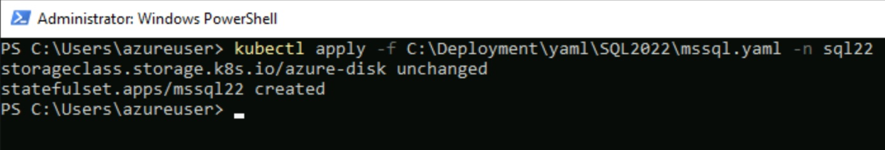
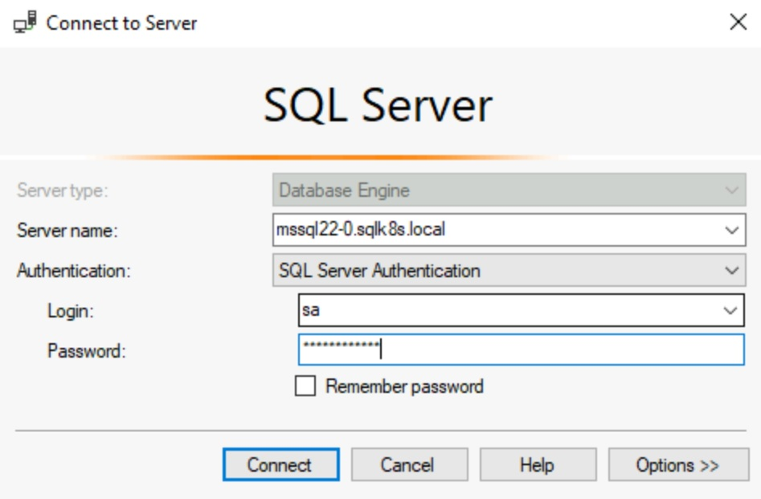
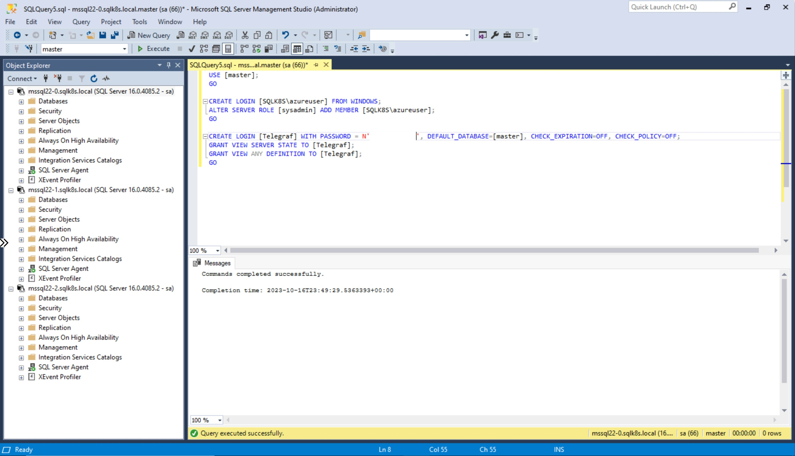
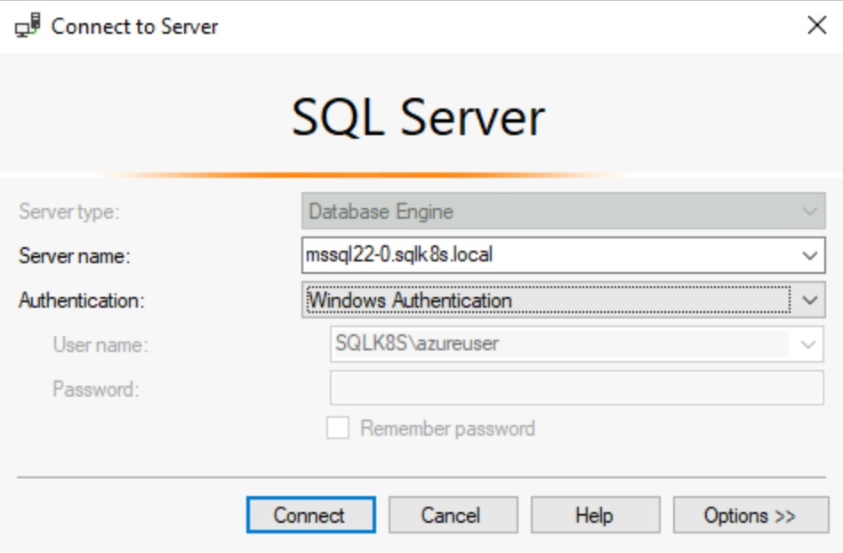
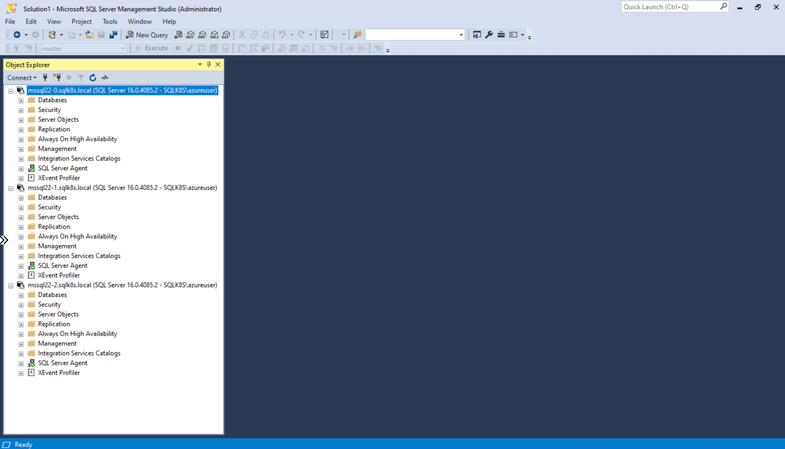

# Create SQL Server 2022 Container Instances

[< Previous Module](../modules/hadr19.md) - **[Home](../README.md)** - [Next Module >](../modules/hadr22.md)

## Install and configure SQL Server 2022 on Containers

1. Connect to SqlK8sJumpbox via Bastion (using domain account i.e. \<adminUsername\>@sqlk8s.local)

    

2. Open Powershell

    

3. Login to Azure AD using the System Managed Identity for SqlK8sJumpbox (**AKS** Platform only)

    ```text
    az login --identity
    ```

    

4. Connect to your AKS Cluster in the scope of your \<resourceGroup\> and store the profile (**AKS** Platform only)

    ```text
    az aks get-credentials -n sqlk8saks -g <resourceGroup>
    ```

    

5. Create SQL Namespace

    ```text
    kubectl create namespace sql22
    ```

    

6. Create headless services which will allow your SQL Server pods to connect to one another using hostnames

    **NB: Only applies to SQL Server Installs with Availabilty Groups**

    ```text
    kubectl apply -f C:\Deployment\yaml\SQL2022\headless-services.yaml -n sql22
    ```

    

7. Create secret for SQL Server sa password using \<adminPassword\> for consistency

    ```text
    kubectl create secret generic mssql22 --from-literal=MSSQL_SA_PASSWORD=<adminPassword> -n sql22
    ```

    

8. Apply the Kerberos configuration file

    ```text
    kubectl apply -f C:\Deployment\yaml\SQL2022\krb5-conf.yaml -n sql22
    ```

    

9. Apply the SQL Server Configuration

    ```text
    kubectl apply -f C:\Deployment\yaml\SQL2022\mssql-conf.yaml -n sql22
    ```

    

10. Apply StatefulSet configuration of SQL Server and install cluster software (dxe)

    ```text
    kubectl apply -f C:\Deployment\yaml\SQL2022\mssql.yaml -n sql22
    ```

    

11. Add internal load balancers for each node

    ```text
    kubectl apply -f C:\Deployment\yaml\SQL2022\pod-service.yaml -n sql22
    ```

    

12. Verify pods and services are up and running

    **NB: You will see one pod \/ service for Standalone instances and three pods \/ services for Availability Group setup**

    ```text
    kubectl get pods -n sql22
    ```

    

    ```text
    kubectl get services -n sql22
    ```

    

13. Check pods by nodes (there are usually two pods per node)

    ```text
    kubectl get pod -o=custom-columns=NAME:.metadata.name,STATUS:.status.phase,NODE:.spec.nodeName -n sql22
    ```

    

14. Copy the keytab files to each pod

    Standalone setup

    ```text
    kubectl cp \..\Deployment\keytab\SQL2022\mssql_mssql22-0.keytab mssql22-0:/var/opt/mssql/secrets/mssql.keytab -n sql22
    ```

    Availability Group setup

    ```text
    kubectl cp \..\Deployment\keytab\SQL2022\mssql_mssql22-0.keytab mssql22-0:/var/opt/mssql/secrets/mssql.keytab -n sql22
    kubectl cp \..\Deployment\keytab\SQL2022\mssql_mssql22-1.keytab mssql22-1:/var/opt/mssql/secrets/mssql.keytab -n sql22
    kubectl cp \..\Deployment\keytab\SQL2022\mssql_mssql22-2.keytab mssql22-2:/var/opt/mssql/secrets/mssql.keytab -n sql22
    ```

    

15. Copy logger.ini files to each pod

    Standalone setup

    ```text
    kubectl cp "\..\Deployment\yaml\SQL2022\logger.ini" mssql22-0:/var/opt/mssql/logger.ini -n sql22
    ```

    Availability Group setup

    ```text
    kubectl cp "\..\Deployment\yaml\SQL2022\logger.ini" mssql22-0:/var/opt/mssql/logger.ini -n sql22
    kubectl cp "\..\Deployment\yaml\SQL2022\logger.ini" mssql22-1:/var/opt/mssql/logger.ini -n sql22
    kubectl cp "\..\Deployment\yaml\SQL2022\logger.ini" mssql22-2:/var/opt/mssql/logger.ini -n sql22
    ```

    

16. Copy TLS Certificate and Key files to each pod

    Standalone setup

    ```text
    kubectl cp "\..\Deployment\certificates\SQL2022\mssql22-0.pem" mssql22-0:/var/opt/mssql/certs/mssql.pem -n sql22
    kubectl cp "\..\Deployment\certificates\SQL2022\mssql22-0.key" mssql22-0:/var/opt/mssql/private/mssql.key -n sql22
    ```

    Availability Group setup

    ```text
    kubectl cp "\..\Deployment\certificates\SQL2022\mssql22-0.pem" mssql22-0:/var/opt/mssql/certs/mssql.pem -n sql22
    kubectl cp "\..\Deployment\certificates\SQL2022\mssql22-0.key" mssql22-0:/var/opt/mssql/private/mssql.key -n sql22
    kubectl cp "\..\Deployment\certificates\SQL2022\mssql22-1.pem" mssql22-1:/var/opt/mssql/certs/mssql.pem -n sql22
    kubectl cp "\..\Deployment\certificates\SQL2022\mssql22-1.key" mssql22-1:/var/opt/mssql/private/mssql.key -n sql22
    kubectl cp "\..\Deployment\certificates\SQL2022\mssql22-2.pem" mssql22-2:/var/opt/mssql/certs/mssql.pem -n sql22
    kubectl cp "\..\Deployment\certificates\SQL2022\mssql22-2.key" mssql22-2:/var/opt/mssql/private/mssql.key -n sql22
    ```

    

17. Update mssql-conf

    ```text
    kubectl apply -f C:\Deployment\yaml\SQL2022\mssql-conf-encryption.yaml -n sql22
    ```

    

18. Delete each pod so they are re-created with Kerberos and TLS correctly configured

    **NB: This also tests the High Availability of each SQL Server Instance before the availability group is implemented**

    Standalone setup

    ```text
    kubectl delete pod mssql22-0 -n sql22
    ```

    Availability Group setup

    ```text
    kubectl delete pod mssql22-0 -n sql22
    kubectl delete pod mssql22-1 -n sql22
    kubectl delete pod mssql22-2 -n sql22
    ```

    

19. Verify pods are back up and running

    **NB: You will see one pod \/ service for Standalone instances and three pods \/ services for Availability Group setup**

    ```text
    kubectl get pods -n sql22
    ```

    

20. Open SQL Server Management Studio and connect to each of the SQL Containers using their Fully Qualified Domain Name (i.e. mssql22-0.sqlk8s.local, mssql22-1.sqlk8s.local, mssql22-2.sqlk8s.local) with SQL authentication (sa account and \<adminPassword\>).

    **NB: For Standalone setup you will just connect to mssql22-0.sqlk8s.local**

    

    

    

21. Open a T-SQL session on each pod (container) and create a Windows login for \<adminUsername\> with sysadmin permissions

    **NB: On the same sessions, create a SQL login for Telegraf which will be used later in the monitor section (using \<adminPassword\> for consistency)**

    ```text
    USE [master];
    GO

    CREATE LOGIN [SQLK8S\<adminUsername>] FROM WINDOWS;
    ALTER SERVER ROLE [sysadmin] ADD MEMBER [SQLK8S\<adminUsername>];
    GO

    CREATE LOGIN [Telegraf] WITH PASSWORD = N'<adminPassword>', DEFAULT_DATABASE=[master], CHECK_EXPIRATION=OFF, CHECK_POLICY=OFF;
    GRANT VIEW SERVER STATE TO [Telegraf];
    GRANT VIEW ANY DEFINITION TO [Telegraf];
    GO
    ```

    

22. You should now be able to login to each instance using Windows Authentication (SQLK8S\\\<adminUsername\>)

    

    

23. Open a T-SQL session on each pod (container) and confirm that Kerberos and TLS are configured correctly

    ```text
    SELECT
        session_id
        , net_transport
        , protocol_type
        , encrypt_option
        , auth_scheme
    FROM
        sys.dm_exec_connections
    WHERE
        session_id = @@SPID;
    GO
    ```

    

If you have opted for a Standalone SQL Server instance then go to the page on "[How to configure logins and users on SQL Server Availability Groups](./modules/logins.md)".  Otherwise hit **Continue** at the bottom of the page to move to the Contained Availability Group configuration tutorial.

[Continue >](../modules/hadr22.md)
