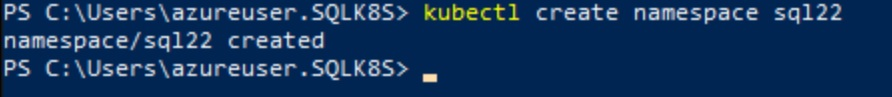
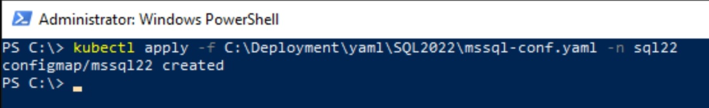
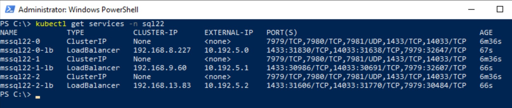
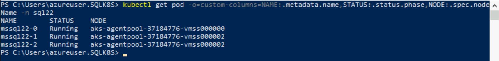
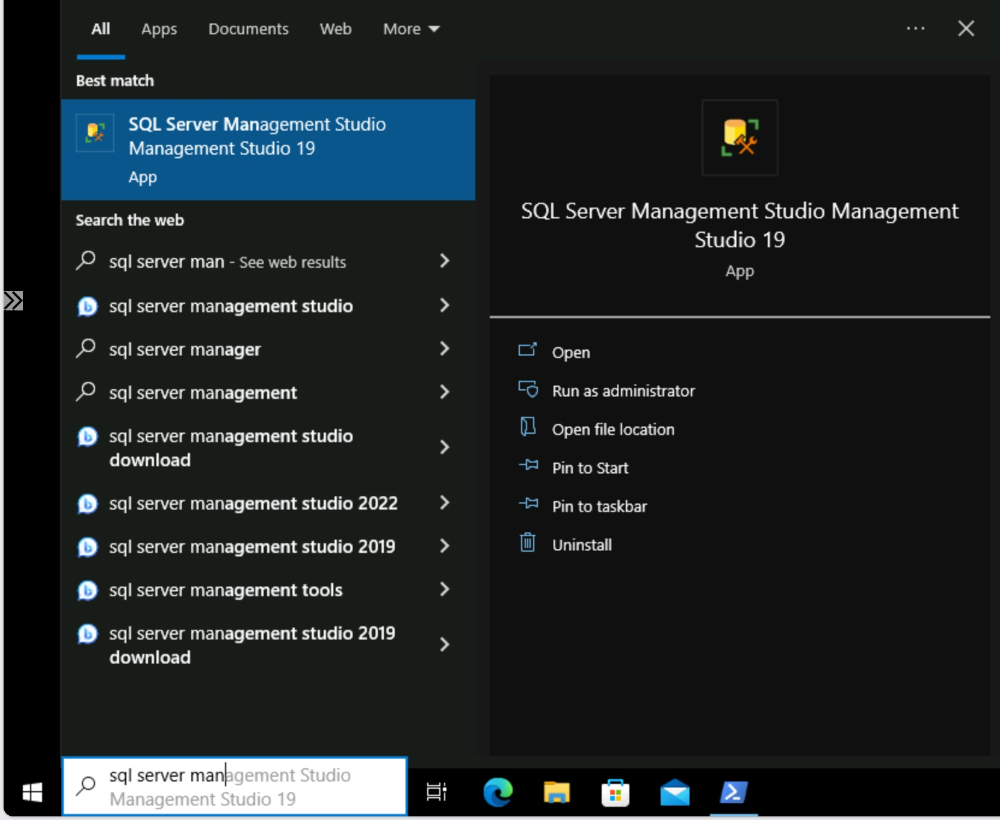
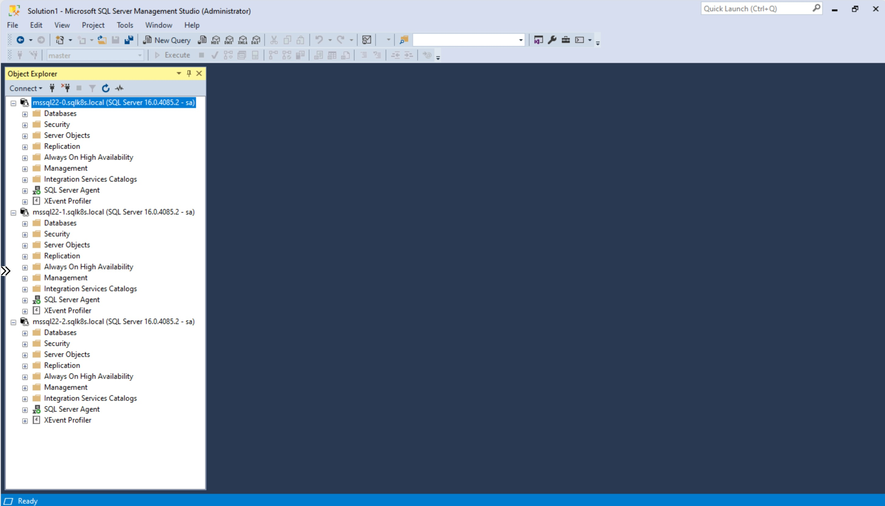

# Create SQL Server 2022 Container Instances

[< Previous Module](../modules/hadr19.md) - **[Home](../README.md)** - [Next Module >](../modules/hadr22.md)

## Install and configure SQL Server 2022 on Containers

**NB: This page is all about installing and configuring the SQL Server Container Instances.  However, there are some prerequisites for the clustering technology which will also be configured.**

**DH2I is the clustering technology of choice.  For more information refer to https://support.dh2i.com/docs/guides/dxenterprise/containers/kubernetes/mssql-ag-k8s-statefulset-qsg/.**

1. Connect to SqlK8sJumpbox via Bastion (using domain account i.e. \<azureUser\>.sqlk8s.local)

    

2. Open Powershell

    

3. Login to Azure AD with an account that has ownership permissions to your subscription

    ```text
    az login
    ```

    

    

    

4.	Configure your account to be in the scope of your subscription (get the \<subscriptionId\> from your Resource Group page)

    ```text
    az account set --subscription <subscriptionId>
    ```

    

5. Connect to your AKS Cluster in the scope of your \<resourceGroup\> and store the profile

    ```text
    az aks get-credentials -n sqlk8saks -g <resourceGroup>
    ```

    

6. Create SQL Namespace

    ```text
    kubectl create namespace sql22
    ```

    

7. Create headless services which will allow your SQL Server pods to connect to one another using hostnames

    ```text
    kubectl apply -f C:\SQLServerk8s-main\yaml\SQLContainerDeployment\SQL2022\headless-services.yaml -n sql22
    ```

    

8. Create secret for SQL Server sa password using \<azurePassword\> for consistency

    ```text
    kubectl create secret generic mssql22 --from-literal=MSSQL_SA_PASSWORD=<azurePassword> -n sql22
    ```

    

9. Apply the Kerberos configuration file

    ```text
    kubectl apply -f C:\SQLServerk8s-main\yaml\SQLContainerDeployment\SQL2022\krb5-conf.yaml -n sql22
    ```

    

10. Apply the SQL Server Configuration

    ```text
    kubectl apply -f C:\SQLServerk8s-main\yaml\SQLContainerDeployment\SQL2022\mssql-conf.yaml -n sql22
    ```

    

11. Apply StatefulSet configuration of SQL Server and install cluster software (dxe)

    ```text
    kubectl apply -f C:\SQLServerk8s-main\yaml\SQLContainerDeployment\SQL2022\dxemssql.yaml -n sql22
    ```

    

12. Add internal load balancers for each node

    ```text
    kubectl apply -f C:\SQLServerk8s-main\yaml\SQLContainerDeployment\SQL2022\pod-service.yaml -n sql22
    ```

    

13. Verify pods and services are up and running

    ```text
    kubectl get pods -n sql22
    ```

    

    ```text
    kubectl get services -n sql22
    ```

    

14. Check pods by nodes (there will be 2 nodes if you are only running one instance e.g. SQL 2019 or SQL 2022, but this could increase up to 4 nodes if running both)

    ```text
    kubectl get pod -o=custom-columns=NAME:.metadata.name,STATUS:.status.phase,NODE:.spec.nodeName -n sql22
    ```

    

15. Copy the keytab files (created in the kerberos module) to all 3 SQL Pods

    ```text
    kubectl cp \..\SQLContainerDeployment\SQL2022\mssql_mssql22-0.keytab mssql22-0:/var/opt/mssql/secrets/mssql.keytab -n sql22
    kubectl cp \..\SQLContainerDeployment\SQL2022\mssql_mssql22-1.keytab mssql22-1:/var/opt/mssql/secrets/mssql.keytab -n sql22
    kubectl cp \..\SQLContainerDeployment\SQL2022\mssql_mssql22-2.keytab mssql22-2:/var/opt/mssql/secrets/mssql.keytab -n sql22
    ```

    

16. Copy logger.ini files to all 3 SQL Pods

    ```text
    kubectl cp "\..\SQLServerk8s-main\yaml\SQLContainerDeployment\SQL2022\logger.ini" mssql22-0:/var/opt/mssql/logger.ini -n sql22
    kubectl cp "\..\SQLServerk8s-main\yaml\SQLContainerDeployment\SQL2022\logger.ini" mssql22-1:/var/opt/mssql/logger.ini -n sql22
    kubectl cp "\..\SQLServerk8s-main\yaml\SQLContainerDeployment\SQL2022\logger.ini" mssql22-2:/var/opt/mssql/logger.ini -n sql22
    ```

    

17. Delete all 3 pods so they are re-created with Kerberos correctly configured

    **NB: This also tests the High Availability of each SQL Server Instance before the availability group is implemented**

    ```text
    kubectl delete pod mssql22-0 -n sql22
    kubectl delete pod mssql22-1 -n sql22
    kubectl delete pod mssql22-2 -n sql22
    ```

    

18. Verify pods are back up and running

    ```text
    kubectl get pods -n sql22
    ```

    

19. Open SQL Server Management Studio and connect to each of the SQL Containers (i.e. mssql22-0, mssql22-1, mssql22-2) using SQL authentication (sa account and \<azurePassword\>)

    

    

    

20. Open a T-SQL session on each pod (container) and create a Windows login for \<azureUser\> with sysadmin permissions

    **NB: On the same sessions, create a SQL login for Telegraf which will be used later in the monitor section (using \<azurePassword\> for consistency)**

    ```text
    USE [master];
    GO

    CREATE LOGIN [SQLK8S\<azureUser>] FROM WINDOWS;
    ALTER SERVER ROLE [sysadmin] ADD MEMBER [SQLK8S\<azureUser>];
    GO

    CREATE LOGIN [Telegraf] WITH PASSWORD = N'<azurePassword>';
    GRANT VIEW SERVER STATE TO [Telegraf];
    GRANT VIEW ANY DEFINITION TO [Telegraf];
    GO
    ```

    

21. You should now be able to login to all 3 instances using Windows Authentication (SQLK8S\\\<azureUser\>)

    

    

[Continue >](../modules/hadr22.md)
